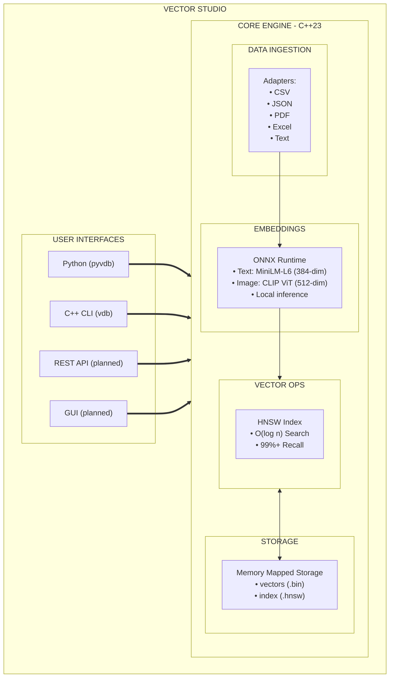

# ⬜️ HECKTOR
> Vector Studio

Meet Hecktor, the AI Vector Studio. This comprehensive guide covers everything from basic usage to advanced topics and API reference.

## INDEX

| #   | Document                                                     | Description                                                       | Audience                   |
| --- | ------------------------------------------------------------ | ----------------------------------------------------------------- | -------------------------- |
| 01  | [**README**](01_README.md)                                   | This file - Introduction, documentation overview and quick start  | All users                  |
| 02  | [**GETTING_STARTED**](02_INSTALLATION.md)                    | Installation, quick start, basic usage, CLI reference             | Beginners                  |
| 03  | [**USER_GUIDE**](04_USER_GUIDE.md)                           | Complete user guide from installation to advanced usage           | All users                  |
| 04  | [**DATA_FORMATS**](06_DATA_FORMATS.md)                       | Supported data types, formats, and specifications                 | Data engineers, developers |
| 05  | [**DATA_INGESTION**](07_DATA_INGESTION.md)                   | Data ingestion module with adapters (CSV, JSON, PDF, Excel, Text) | Data engineers             |
| 06  | [**ARCHITECTURE**](05_ARCHITECTURE.md)                       | System design, data flow, component diagrams                      | Architects, contributors   |
| 07  | [**API_REFERENCE**](20_API_REFERENCE.md)                     | Detailed API documentation for all classes and functions          | Developers                 |
| 08  | [**MODELS**](08_EMBEDDINGS_MODELS.md)                        | Model specifications, benchmarks, integration                     | ML practitioners           |
| 09  | [**MATH**](09_VECTOR_OPERATIONS.md)                          | Mathematical foundations, HNSW algorithm, distance metrics        | ML engineers               |
| 10  | [**AI_TRAINING**](10_AI_TRAINING.md)                         | Training custom models, fine-tuning, contrastive learning         | AI researchers             |
| 11  | [**LOGGING**](15_LOGGING_MONITORING.md)                      | Comprehensive logging system with anomaly detection               | DevOps, developers         |
| 12  | [**USAGE_EXAMPLES**](12_USAGE_EXAMPLES.md)                   | Code examples and common usage patterns                           | All developers             |
| 13  | [**DEPLOYMENT**](16_DEPLOYMENT.md)                           | Production deployment guide                                       | DevOps, architects         |
| 14  | [**REAL_WORLD_APPLICATIONS**](19_REAL_WORLD_APPLICATIONS.md) | Production use cases and benchmarks                               | Solution architects        |
| 15  | [**LLM_ENGINE**](13_LLM_ENGINE.md)                           | **NEW** - Local text generation with llama.cpp                    | AI developers              |
| 16  | [**QUANTIZATION**](14_QUANTIZATION.md)                       | **NEW** - Vector compression techniques (4-32x)                   | Performance engineers      |
| 17  | [**HTTP_ADAPTER**](17_HTTP_ADAPTER.md)                       | **NEW** - HTTP adapter for web API data ingestion                 | Data engineers             |

## Quick Links by Task

### Getting Started
- [Installation Guide](04_USER_GUIDE.md#installation)
- [Quick Start Tutorial](02_INSTALLATION.md#quick-start)
- [First Database](02_INSTALLATION.md#first-database)

### Data Ingestion
- [Supported Data Formats](06_DATA_FORMATS.md) - **Complete format specifications**
- [Universal Data Adapters](07_DATA_INGESTION.md)
- [CSV Adapter](07_DATA_INGESTION.md#1-csv-adapter)
- [JSON Adapter](07_DATA_INGESTION.md#2-json-adapter)
- [Text Adapter](07_DATA_INGESTION.md#3-plain-text-adapter)
- [PDF Adapter](07_DATA_INGESTION.md#4-pdf-adapter)
- [Excel Adapter](07_DATA_INGESTION.md#5-excel-adapter)

### Core Operations
- [Adding Vectors](04_USER_GUIDE.md#adding-vectors)
- [Searching](04_USER_GUIDE.md#searching)
- [Batch Operations](04_USER_GUIDE.md#batch-operations)

### API Reference
- [VectorDatabase API](20_API_REFERENCE.md#vectordatabase)
- [DataAdapterManager API](20_API_REFERENCE.md#dataadaptermanager)
- [TextEncoder API](20_API_REFERENCE.md#textencoder)
- [Python Bindings](20_API_REFERENCE.md#python-bindings-api)

### Advanced Topics
- [Performance Tuning](04_USER_GUIDE.md#performance-tuning)
- [Custom Adapters](07_DATA_INGESTION.md#custom-adapter-development)
- [HNSW Configuration](04_USER_GUIDE.md#hnsw-index)
- [Distributed Deployment](04_USER_GUIDE.md#distributed-deployment)

## What is Vector Studio?

Vector Studio is a high-performance vector database and AI training platform designed for semantic search and machine learning applications. It provides:

- **Fast Similarity Search**: Sub-millisecond queries on millions of vectors
- **Universal Data Ingestion**: CSV, JSON, PDF, Excel, Plain Text formats with automatic detection
- **Local Embedding Generation**: ONNX-based inference for text and images
- **Gold Standard Integration**: Seamless connection with Gold Standard journal system
- **AI Training Toolkit**: Tools for fine-tuning and training custom models
- **Python Bindings**: Easy integration with Python workflows

## Architecture Overview



## Getting Started

### Quick Setup

For complete installation instructions, see **[02_INSTALLATION.md](02_INSTALLATION.md)**.

For a quick start with Docker or Kubernetes, see **[03_QUICKSTART.md](03_QUICKSTART.md)**.

### First Database Example

```python
import pyvdb

# Create database
db = pyvdb.create_gold_standard_db("./my_vectors")

# Add documents
db.add_text("Gold analysis for today", {
    "type": "Journal",
    "date": "2025-12-01"
})

# Search
results = db.search("gold outlook", k=5)
```

### Learn More

- **Installation & Setup**: See [02_INSTALLATION.md](02_INSTALLATION.md) for detailed installation steps
- **Quick Start**: See [03_QUICKSTART.md](03_QUICKSTART.md) for Docker/Kubernetes deployment
- **Complete User Guide**: See [04_USER_GUIDE.md](04_USER_GUIDE.md) for all features
- **Data Formats**: Review [06_DATA_FORMATS.md](06_DATA_FORMATS.md) for complete format specifications
- **Developers**: Read [05_ARCHITECTURE.md](05_ARCHITECTURE.md)
- **Researchers**: Explore [09_VECTOR_OPERATIONS.md](09_VECTOR_OPERATIONS.md) and [10_AI_TRAINING.md](10_AI_TRAINING.md)
- **Model Selection**: See [08_EMBEDDINGS_MODELS.md](08_EMBEDDINGS_MODELS.md)

## Key Features

### Performance

| Metric | Value |
|--------|-------|
| Query latency (1M vectors) | ~3ms |
| Insertion throughput | 10,000/sec |
| Recall@10 | 99%+ |
| Memory per vector | ~1.2 KB |

### AI Capabilities

- **Text Embeddings**: MiniLM, MPNet, E5 models
- **Image Embeddings**: CLIP ViT (cross-modal search)
- **Custom Training**: Fine-tune or train from scratch
- **Local Inference**: No cloud dependency

### Integration

- **Python**: Full pyvdb bindings
- **CLI**: vdb command-line tool
- **Export**: Training data extraction


## License

Vector Studio is released under the MIT License. See [../LICENSE](../LICENSE) for details.

## Contributing

See [CONTRIBUTING.md](../CONTRIBUTING.md) for contribution guidelines.
