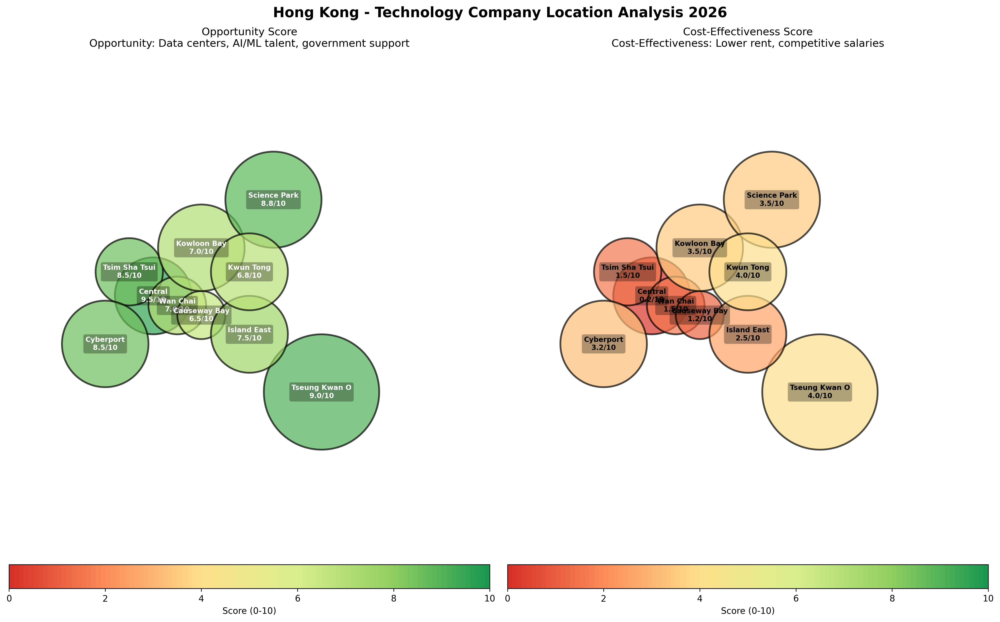

# HEKTOR & ARTIFACT VIRTUAL ENTERPRISE
## COMPREHENSIVE BUSINESS PLAN: HONG KONG OPERATIONS

**Document Version:** 1.0  
**Date:** January 30, 2026  
**Classification:** Confidential - Strategic Planning  
**Location:** Hong Kong Special Administrative Region

---

## EXECUTIVE SUMMARY

This business plan outlines the establishment and operation of **Hektor Vector Database** and the larger **Artifact Virtual Enterprise** (infrastructure development company) in Hong Kong. The plan covers exhaustive costs, market opportunities, operational requirements, and strategic positioning for both ventures in one of Asia's premier technology and financial hubs.

**Key Highlights:**
- **Hektor Vector Database:** Open-source vector database targeting Asia-Pacific's $800M+ market (2026)
- **Artifact Virtual Enterprise:** Infrastructure development company targeting Hong Kong's $5.81B data center market
- **Total Initial Investment:** HKD $45-65M (USD $5.8-8.3M)
- **Break-even Timeline:** 18-24 months (Hektor), 24-36 months (Artifact)
- **Target Market:** APAC enterprises, financial services, AI/ML companies, hyperscale infrastructure

---


*Figure 1: Hong Kong Technology Company Location Analysis - Opportunity and Cost-Effectiveness*

---

## TABLE OF CONTENTS

1. [Market Analysis & Opportunity](#market-analysis)
2. [Company Structure & Jurisdiction](#company-structure)
3. [Business Activities](#business-activities)
4. [Location Selection & Facilities](#location-selection)
5. [Comprehensive Cost Analysis](#cost-analysis)
6. [Family & Living Costs](#family-costs)
7. [Staffing & Talent](#staffing)
8. [Financial Projections](#financial-projections)
9. [Risk Analysis](#risk-analysis)
10. [Implementation Timeline](#timeline)

---

## 1. MARKET ANALYSIS & OPPORTUNITY <a name="market-analysis"></a>

### 1.1 Vector Database Market (Hektor)

**Asia-Pacific Market Size:**
- 2026: USD $800M-1.2B (APAC portion of $2.65B global market)
- 2030: USD $3.2B (APAC), CAGR 27.5%
- Hong Kong Position: Strategic gateway to mainland China and APAC

**Key Drivers:**
- AI/ML adoption in financial services (Hong Kong's largest sector)
- Digital transformation in banking and e-commerce
- Real-time semantic search and RAG applications
- Government Innovation & Technology Development Blueprint

**Competitive Landscape:**
- Limited local vector database providers
- Dominated by US/European solutions (Pinecone, Weaviate, Milvus)
- Opportunity for localized, low-latency APAC solution
- Data sovereignty requirements favor local deployment

**Target Customers:**
- Financial institutions (HSBC, Bank of China, local banks)
- E-commerce platforms expanding in Asia
- AI research institutions
- Government technology initiatives
- Mainland China enterprises (via Hong Kong gateway)

### 1.2 Infrastructure Development Market (Artifact Virtual Enterprise)

**Hong Kong Data Center Market:**
- Market Size: USD $5.81B investment projected by 2031
- Annual Growth: 8-12% (AI-driven demand)
- **Critical Need:** Tseung Kwan O designated as primary data center hub
- Power Supply Challenge: Grid capacity constraints driving innovation

**Key Opportunities:**
1. **Data Center Development:**
   - AI-optimized facilities (high-density racks, advanced cooling)
   - Colocation services for regional enterprises
   - Hyperscale partnerships (Alibaba, Tencent, international clouds)

2. **Infrastructure Services:**
   - Power management and renewable energy solutions
   - Cooling systems (liquid cooling for AI workloads)
   - Network connectivity and submarine cable access
   - Smart city infrastructure integration

3. **Mainland China Gateway:**
   - Hong Kong as data bridge to Greater Bay Area
   - Cross-border data transfer infrastructure
   - Regulatory compliance services

**Major Competitors/Partners:**
- SUNeVision (iAdvantage), Equinix, Digital Realty, NTT
- Goodman Group, AirTrunk, GDS Holdings
- Opportunity for specialized AI infrastructure niche

---

## 2. COMPANY STRUCTURE & JURISDICTION <a name="company-structure"></a>

### 2.1 Legal Structure

**Primary Entity: Hong Kong Private Limited Company**

**Advantages of Hong Kong:**
- Low corporate tax: 8.25% (first HKD $2M), 16.5% thereafter
- No VAT/sales tax, no capital gains tax, no withholding tax on dividends
- Simple tax system (territorial basis)
- Strategic access to mainland China via Greater Bay Area
- Strong IP protection and rule of law
- Free flow of capital and foreign exchange
- World-class banking and financial infrastructure

**Corporate Structure:**

```
Hektor-Artifact Holdings Limited (Hong Kong)
│
├─── Hektor Vector Database (Hong Kong) Ltd
│    ├─ Product development and R&D
│    ├─ Asia-Pacific sales and support
│    └─ Professional services
│
└─── Artifact Virtual Enterprise (Hong Kong) Ltd
     ├─ Infrastructure development
     ├─ Data center operations
     └─ Engineering and construction services
```

### 2.2 Company Registration Costs

**Initial Setup (per entity):**
- Company name reservation: HKD $150
- Incorporation fee (electronic): HKD $1,545
- Business Registration Certificate (1-year): HKD $2,200
- **Total government fees:** HKD $3,895 per company

**For 2 companies:** HKD $7,790 (USD $1,000)

**Professional Services:**
- Corporate secretarial package: HKD $8,000-12,000/year (per company)
- Registered office address: HKD $3,000-5,000/year
- Company seal and minute books: HKD $500
- Legal consultation for setup: HKD $15,000-25,000

**Total Setup Cost (2 companies):** HKD $45,000-70,000 (USD $5,800-9,000)

### 2.3 Ongoing Compliance Costs (Annual, per company)

- Company secretary: HKD $3,000-5,000/year
- Registered address: HKD $3,000/year
- Business registration renewal: HKD $2,200/year
- Annual return filing (NAR1): HKD $105/year
- Accounting and bookkeeping: HKD $24,000-60,000/year
- Audit (mandatory if active): HKD $15,000-30,000/year
- Tax filing: HKD $8,000-15,000/year

**Total Annual Compliance (2 companies):** HKD $110,000-230,000/year (USD $14,000-30,000/year)

---

## 3. BUSINESS ACTIVITIES <a name="business-activities"></a>

### 3.1 Hektor Vector Database - Core Activities

**Products & Services:**

1. **Open Source Vector Database (MIT License)**
   - Free, self-hosted deployment
   - Community support via GitHub/Discord
   - Full feature set with SIMD optimization
   - Target: Developer community and startups

2. **Enterprise Support Subscriptions (HKD)**
   - Basic Support: HKD $40,000/year (Email, 48h SLA)
   - Standard Support: HKD $120,000/year (24h SLA, monthly check-ins)
   - Premium Support: HKD $400,000/year (24/7, dedicated engineer)
   - Enterprise: HKD $800,000-4,000,000/year (Custom SLAs, TAM)

3. **Professional Services**
   - Migration services: HKD $200,000-800,000 per project
   - Custom development: HKD $1,600/hour
   - Training programs: HKD $40,000/day
   - Architecture consulting: HKD $60,000/day

4. **Hektor Cloud (Managed Service - Launch 2027)**
   - Usage-based pricing
   - Multi-cloud deployment (Alibaba Cloud, AWS, Azure, Tencent Cloud)
   - 40-50% below Pinecone pricing
   - Target: SMBs and enterprises wanting managed solution

**Revenue Model (2026-2029):**
- Year 1: 70% support, 30% services
- Year 2: 50% support, 20% services, 30% cloud
- Year 3: 35% support, 15% services, 45% cloud, 5% partnerships

### 3.2 Artifact Virtual Enterprise - Core Activities

**Infrastructure Development Services:**

1. **Data Center Development**
   - Design and construction of AI-optimized facilities
   - Retrofit of existing facilities for AI workloads
   - Modular data center deployment
   - Target: Tseung Kwan O, Tai Po industrial areas

2. **Colocation & Hosting Services**
   - Rack space rental: HKD $12,000-25,000/rack/month
   - Power provisioning (up to 20 kW/rack for AI)
   - Cooling and environmental management
   - 99.99% uptime SLA

3. **Infrastructure Consulting**
   - Power optimization and renewable energy integration
   - Advanced cooling systems (liquid cooling for GPUs)
   - Network architecture and connectivity
   - Compliance and certification (Tier III/IV standards)

4. **Engineering Services**
   - Electrical and mechanical engineering
   - HVAC and cooling system design
   - Building management systems (BMS)
   - Security and access control

**Revenue Model:**
- Colocation: 50-60% (recurring revenue)
- Development projects: 25-30% (project-based)
- Consulting & engineering: 10-15%
- Managed services: 5-10%

---

## 4. LOCATION SELECTION & FACILITIES <a name="location-selection"></a>

### 4.1 Office Location Analysis

**Recommended: Tseung Kwan O (Primary) + Science Park (Secondary)**

**Tseung Kwan O Industrial Estate:**
- **Advantages:**
  - Hong Kong's designated data center hub
  - Lower rent: HKD $18-25/sq ft/month vs HKD $80-120 in Central
  - Proximity to submarine cable landing stations
  - Ample power supply infrastructure
  - Government support for tech development
  - Land available for data center construction

- **Suitable for:** Artifact Virtual Enterprise (primary operations)
- **Office Space Needed:** 5,000-10,000 sq ft
- **Monthly Rent:** HKD $90,000-250,000
- **Fit-out costs:** HKD $500-800/sq ft (one-time)

**Hong Kong Science Park (Sha Tin):**
- **Advantages:**
  - Government technology hub with subsidies
  - Access to innovation ecosystem
  - Networking with research institutions
  - Lower rent than CBD: HKD $25-35/sq ft/month
  - Talent pool from universities
  - Incubation program support available

- **Suitable for:** Hektor Vector Database (R&D and sales)
- **Office Space Needed:** 3,000-5,000 sq ft
- **Monthly Rent:** HKD $75,000-175,000
- **Fit-out costs:** HKD $400-600/sq ft

**Alternative: Cyberport (Aberdeen)**
- Similar advantages to Science Park
- Focus on digital tech and fintech
- Rent: HKD $22-32/sq ft/month
- Good for customer-facing operations

**Central/CBD Presence (Optional):**
- Small sales office: 500-1,000 sq ft
- Monthly rent: HKD $50,000-100,000
- For client meetings and corporate presence

### 4.2 Facility Requirements Summary

**Hektor Vector Database:**
- Office: 3,000-5,000 sq ft (Science Park or Cyberport)
- Server room: 500-1,000 sq ft for development infrastructure
- Meeting rooms: 2-3 conference rooms
- Open workspace for 20-30 employees

**Artifact Virtual Enterprise:**
- Office/Engineering: 5,000-10,000 sq ft (Tseung Kwan O)
- Workshop/Lab: 2,000-3,000 sq ft for equipment testing
- Initial data center module: 5,000-10,000 sq ft (phase 1)
- Warehouse: 2,000 sq ft for parts and equipment

**Total Rent Budget (Monthly):**
- Hektor: HKD $75,000-175,000
- Artifact: HKD $90,000-250,000
- Optional CBD office: HKD $50,000-100,000
- **Total:** HKD $215,000-525,000/month (USD $27,500-67,000/month)

### 4.3 Utilities & Operating Costs

**Monthly Utilities (per facility):**
- Electricity (office): HKD $15,000-30,000/month
- Electricity (data center/lab): HKD $100,000-300,000/month (depending on capacity)
- Water: HKD $2,000-5,000/month
- Internet/Connectivity: HKD $10,000-50,000/month (enterprise fiber)
- Phone system: HKD $3,000-8,000/month
- Building management fees: HKD $10-20/sq ft/month

**Total Monthly Utilities:** HKD $200,000-500,000 (USD $26,000-64,000)

---

## 5. COMPREHENSIVE COST ANALYSIS <a name="cost-analysis"></a>

### 5.1 Initial Capital Investment

**Company Setup & Legal (One-time):**
| Item | Cost (HKD) | Cost (USD) |
|------|------------|------------|
| Company registration (2 entities) | 7,790 | 1,000 |
| Professional services & legal | 45,000-70,000 | 5,800-9,000 |
| Corporate secretarial setup | 16,000-24,000 | 2,050-3,100 |
| Business licenses | 10,000-20,000 | 1,300-2,600 |
| **Subtotal** | **78,790-121,790** | **10,150-15,700** |

**Office Setup & Infrastructure (One-time):**
| Item | Cost (HKD) | Cost (USD) |
|------|------------|------------|
| Office fit-out (8,000-15,000 sq ft) | 4,000,000-10,000,000 | 513,000-1,282,000 |
| Furniture & equipment | 800,000-1,500,000 | 103,000-192,000 |
| IT infrastructure (servers, network) | 2,000,000-4,000,000 | 256,000-513,000 |
| Security deposits (6 months rent) | 1,290,000-3,150,000 | 165,000-404,000 |
| Initial inventory & supplies | 200,000-500,000 | 26,000-64,000 |
| **Subtotal** | **8,290,000-19,150,000** | **1,063,000-2,455,000** |

**Data Center Infrastructure (Artifact - Phase 1):**
| Item | Cost (HKD) | Cost (USD) |
|------|------------|------------|
| Modular data center (500-1000 sq ft) | 8,000,000-15,000,000 | 1,026,000-1,923,000 |
| Power infrastructure | 3,000,000-6,000,000 | 385,000-769,000 |
| Cooling systems | 2,000,000-4,000,000 | 256,000-513,000 |
| Racks and cabling | 1,000,000-2,000,000 | 128,000-256,000 |
| Fire suppression & security | 800,000-1,500,000 | 103,000-192,000 |
| **Subtotal** | **14,800,000-28,500,000** | **1,898,000-3,653,000** |

**Working Capital (First 6 months):**
| Item | Cost (HKD) | Cost (USD) |
|------|------------|------------|
| Salaries (6 months, 30 staff) | 9,000,000-13,500,000 | 1,154,000-1,731,000 |
| Rent & utilities (6 months) | 2,490,000-6,150,000 | 319,000-788,000 |
| Marketing & sales | 1,500,000-3,000,000 | 192,000-385,000 |
| Professional services | 500,000-1,000,000 | 64,000-128,000 |
| Contingency (10%) | 1,349,000-2,365,000 | 173,000-303,000 |
| **Subtotal** | **14,839,000-26,015,000** | **1,902,000-3,335,000** |

**TOTAL INITIAL INVESTMENT:**
- **Minimum:** HKD $38,007,790 (USD $4.87M)
- **Recommended:** HKD $50,000,000 (USD $6.41M)
- **Full Build-out:** HKD $73,786,790 (USD $9.46M)

### 5.2 Monthly Operating Costs (Steady State)

**Personnel Costs (30 employees initial):**
| Role | Count | Monthly Salary (HKD) | Total (HKD) |
|------|-------|---------------------|-------------|
| CEO/Managing Director | 1 | 200,000-300,000 | 250,000 |
| CTO/VP Engineering (Hektor) | 1 | 150,000-200,000 | 175,000 |
| VP Infrastructure (Artifact) | 1 | 150,000-200,000 | 175,000 |
| Senior Engineers/Architects | 6 | 80,000-120,000 | 600,000 |
| Mid-level Engineers | 10 | 50,000-75,000 | 625,000 |
| Junior Engineers | 5 | 30,000-45,000 | 187,500 |
| Sales & Business Dev | 3 | 45,000-70,000 | 165,000 |
| Support & Operations | 2 | 30,000-40,000 | 70,000 |
| Finance & Admin | 1 | 35,000-50,000 | 42,500 |
| **Subtotal** | **30** | | **2,290,000** |
| Employer MPF (5%) | | | 114,500 |
| **Total Personnel** | | | **2,404,500** |

**Facility Costs (Monthly):**
| Item | Cost (HKD) |
|------|------------|
| Office rent (2 locations) | 165,000-425,000 |
| Utilities & internet | 200,000-500,000 |
| Building management | 80,000-150,000 |
| **Subtotal** | **445,000-1,075,000** |

**Operational Costs (Monthly):**
| Item | Cost (HKD) |
|------|------------|
| Cloud infrastructure (AWS/Alibaba) | 150,000-300,000 |
| Software licenses & tools | 50,000-100,000 |
| Marketing & advertising | 200,000-400,000 |
| Travel & entertainment | 50,000-100,000 |
| Professional services (legal, accounting) | 40,000-80,000 |
| Insurance (D&O, liability, property) | 30,000-60,000 |
| Office supplies & misc | 20,000-40,000 |
| **Subtotal** | **540,000-1,080,000** |

**TOTAL MONTHLY OPERATING COSTS:** HKD $3,389,500-4,559,500 (USD $435,000-585,000)

**ANNUAL OPERATING COSTS:** HKD $40.7M-54.7M (USD $5.2M-7.0M)

---

## 6. FAMILY & LIVING COSTS IN HONG KONG <a name="family-costs"></a>

### 6.1 Housing Costs for Expatriate Families

**Typical 3-Bedroom Apartment:**
| Location | Monthly Rent (HKD) | Monthly Rent (USD) |
|----------|-------------------|-------------------|
| Central/Mid-Levels | 60,000-100,000 | 7,700-12,800 |
| Island South (Repulse Bay) | 50,000-80,000 | 6,400-10,300 |
| Kowloon (Tsim Sha Tsui) | 35,000-55,000 | 4,500-7,100 |
| New Territories (Sha Tin) | 25,000-40,000 | 3,200-5,100 |
| **Average Recommended** | **35,000-50,000** | **4,500-6,400** |

**Utilities (Monthly):**
- Electricity, water, gas: HKD $2,000-3,500
- Internet (1Gbps fiber): HKD $300-500
- Mobile phone (per person): HKD $200-400
- **Total utilities:** HKD $3,000-5,000/month

**Housing Purchase (if buying):**
- City center: HKD $206,480/sq meter (very expensive)
- Suburbs: HKD $123,800/sq meter
- Typical 3-bed (90 sq m): HKD $11-19M (USD $1.4-2.4M)

### 6.2 Education Costs

**International Schools (Annual tuition per child):**
| School Type | Annual Fee (HKD) | Annual Fee (USD) |
|-------------|-----------------|-----------------|
| Entry level (Primary) | 120,000-180,000 | 15,400-23,100 |
| Mid-level | 180,000-250,000 | 23,100-32,100 |
| Premium (IB schools) | 250,000-320,000 | 32,100-41,000 |

**For family with 2 children:** HKD $240,000-500,000/year (USD $30,800-64,100/year)

**Additional Education Costs:**
- School bus: HKD $12,000-18,000/year per child
- Uniforms & supplies: HKD $5,000-10,000/year per child
- Extracurricular activities: HKD $20,000-50,000/year per child

### 6.3 Daily Living Expenses

**Monthly Family Budget (Family of 4):**
| Category | Cost (HKD/month) | Cost (USD/month) |
|----------|-----------------|-----------------|
| Groceries & food | 8,000-12,000 | 1,000-1,500 |
| Dining out | 4,000-8,000 | 500-1,000 |
| Transportation (MTR passes) | 2,000-4,000 | 250-500 |
| Healthcare/Insurance | 3,000-6,000 | 385-770 |
| Household helper (if employed) | 4,630 + room/board | 600 + accommodation |
| Entertainment & recreation | 3,000-6,000 | 385-770 |
| Clothing | 2,000-4,000 | 250-500 |
| Miscellaneous | 2,000-4,000 | 250-500 |
| **Subtotal (excluding rent)** | **28,630-48,630** | **3,670-6,240** |

**Total Monthly Cost for Expat Family (excluding education):**
- Budget option: HKD $53,630-78,630 (USD $6,900-10,100)
- Comfortable: HKD $70,000-95,000 (USD $9,000-12,200)
- Premium: HKD $90,000-130,000 (USD $11,500-16,700)

**Annual Total (Family of 4, including education):**
- **Minimum:** HKD $883,560 (USD $113,300)
- **Comfortable:** HKD $1,200,000 (USD $154,000)
- **Premium:** HKD $1,800,000+ (USD $231,000+)

### 6.4 Relocation Package for Key Executives

**Typical Expat Package (Annual):**
| Item | Cost (HKD) | Cost (USD) |
|------|------------|------------|
| Base salary | 1,800,000-3,600,000 | 231,000-462,000 |
| Housing allowance | 420,000-600,000 | 53,800-76,900 |
| Education allowance (2 children) | 400,000-600,000 | 51,300-76,900 |
| Annual home leave (flights) | 40,000-80,000 | 5,100-10,300 |
| Relocation costs (one-time) | 100,000-200,000 | 12,800-25,600 |
| **Total Package** | **2,760,000-5,080,000** | **354,000-651,000** |

**For 3-5 key expat executives:** HKD $8.3M-25.4M/year (USD $1.1M-3.3M/year)

---

## 7. STAFFING & TALENT ACQUISITION <a name="staffing"></a>

### 7.1 Organizational Structure

**Year 1 (2026): 30 employees**

**Hektor Vector Database Team (15 people):**
- Engineering: 8 (2 senior, 4 mid, 2 junior)
- Product Management: 2
- Sales & Marketing: 3
- Support & Operations: 2

**Artifact Virtual Enterprise Team (15 people):**
- Engineering & Construction: 8 (3 senior, 4 mid, 1 junior)
- Project Management: 2
- Business Development: 2
- Operations: 3

**Shared Services:**
- CEO/Managing Director: 1
- Finance & Admin: 2
- HR & Legal: 1 (outsourced initially)

### 7.2 Talent Pool & Recruitment

**Hong Kong Advantages:**
- 8 major universities producing 5,000+ STEM graduates annually
- Strong engineering talent (HKU, HKUST, CUHK, CityU)
- Multilingual workforce (English, Cantonese, Mandarin)
- Access to Greater Bay Area talent pool (Shenzhen, Guangzhou)
- Government talent attraction schemes

**Key Skills in Demand:**
- Cloud Engineers: HKD $50,000-80,000/month
- Machine Learning Engineers: HKD $60,000-100,000/month
- Data Engineers: HKD $45,000-75,000/month
- DevOps Engineers: HKD $50,000-80,000/month
- Infrastructure Architects: HKD $70,000-120,000/month
- Civil/Electrical Engineers: HKD $40,000-70,000/month

**Recruitment Costs:**
- Agency fees: 25% of annual salary (one-time)
- Job postings & marketing: HKD $50,000-100,000
- Relocation support: HKD $30,000-100,000 per person
- **Total Year 1 Recruitment:** HKD $2-3M

### 7.3 Training & Development

**Annual Investment:**
- Technical training: HKD $10,000-20,000 per employee
- Conferences & events: HKD $15,000-30,000 per employee
- Certifications (AWS, Azure, etc): HKD $5,000-15,000 per person
- **Total Training Budget:** HKD $900,000-1,950,000/year

### 7.4 Employment Costs & Benefits

**Mandatory Costs:**
- Mandatory Provident Fund (MPF): 5% of salary (employer contribution)
- No social security tax (major advantage)
- No payroll tax

**Standard Benefits Package:**
- Annual leave: 14-18 days
- Public holidays: 17 days
- Medical insurance: HKD $5,000-15,000/employee/year
- Life insurance: HKD $2,000-5,000/employee/year
- Annual bonus: 1-3 months salary

**Total Employment Cost:** ~110-120% of base salary

---

## 8. FINANCIAL PROJECTIONS <a name="financial-projections"></a>

### 8.1 Hektor Vector Database Revenue Projections

**Year 1 (2026):**
| Revenue Stream | Amount (HKD) | Amount (USD) |
|----------------|-------------|-------------|
| Enterprise Support | 4,000,000 | 513,000 |
| Professional Services | 2,000,000 | 256,000 |
| **Total** | **6,000,000** | **769,000** |

**Year 2 (2027):**
| Revenue Stream | Amount (HKD) | Amount (USD) |
|----------------|-------------|-------------|
| Enterprise Support | 12,000,000 | 1,538,000 |
| Professional Services | 5,000,000 | 641,000 |
| Hektor Cloud (launched) | 8,000,000 | 1,026,000 |
| **Total** | **25,000,000** | **3,205,000** |

**Year 3 (2028):**
| Revenue Stream | Amount (HKD) | Amount (USD) |
|----------------|-------------|-------------|
| Enterprise Support | 20,000,000 | 2,564,000 |
| Professional Services | 8,000,000 | 1,026,000 |
| Hektor Cloud | 30,000,000 | 3,846,000 |
| Partnerships | 2,000,000 | 256,000 |
| **Total** | **60,000,000** | **7,692,000** |

### 8.2 Artifact Virtual Enterprise Revenue Projections

**Year 1 (2026):**
| Revenue Stream | Amount (HKD) | Amount (USD) |
|----------------|-------------|-------------|
| Consulting & Design | 8,000,000 | 1,026,000 |
| Engineering Services | 5,000,000 | 641,000 |
| Initial Colocation (limited) | 2,000,000 | 256,000 |
| **Total** | **15,000,000** | **1,923,000** |

**Year 2 (2027):**
| Revenue Stream | Amount (HKD) | Amount (USD) |
|----------------|-------------|-------------|
| Data Center Development | 25,000,000 | 3,205,000 |
| Colocation Services | 15,000,000 | 1,923,000 |
| Consulting & Engineering | 10,000,000 | 1,282,000 |
| **Total** | **50,000,000** | **6,410,000** |

**Year 3 (2028):**
| Revenue Stream | Amount (HKD) | Amount (USD) |
|----------------|-------------|-------------|
| Data Center Development | 40,000,000 | 5,128,000 |
| Colocation Services | 35,000,000 | 4,487,000 |
| Consulting & Engineering | 15,000,000 | 1,923,000 |
| Managed Services | 10,000,000 | 1,282,000 |
| **Total** | **100,000,000** | **12,820,000** |

### 8.3 Combined Financial Summary

**Combined Revenue:**
- Year 1: HKD $21M (USD $2.7M)
- Year 2: HKD $75M (USD $9.6M)
- Year 3: HKD $160M (USD $20.5M)

**Operating Expenses:**
- Year 1: HKD $45M (USD $5.8M)
- Year 2: HKD $65M (USD $8.3M) - including expansion
- Year 3: HKD $95M (USD $12.2M)

**EBITDA:**
- Year 1: -HKD $24M (USD -$3.1M) - Investment phase
- Year 2: HKD $10M (USD $1.3M) - Break-even+
- Year 3: HKD $65M (USD $8.3M) - Strong profitability

**Cash Flow Requirements:**
- Initial investment: HKD $50M (USD $6.4M)
- Year 1 deficit funding: HKD $24M (USD $3.1M)
- Growth capital (Year 2): HKD $20M (USD $2.6M)
- **Total 3-Year Funding:** HKD $94M (USD $12.1M)

### 8.4 Break-Even Analysis

**Hektor Vector Database:**
- Break-even: Month 20-22 (Mid-2027)
- Cumulative cash consumption: HKD $18M (USD $2.3M)

**Artifact Virtual Enterprise:**
- Break-even: Month 24-28 (Late 2027/Early 2028)
- Cumulative cash consumption: HKD $30M (USD $3.8M)

**Combined:**
- Operating break-even: Q2-Q3 2027
- Cash flow positive: Q4 2027

---

## 9. RISK ANALYSIS & MITIGATION <a name="risk-analysis"></a>

### 9.1 Market Risks

**Risk: Intense competition from established players**
- Mitigation: Focus on APAC localization, mainland China access, lower pricing
- Differentiation: Perceptual quantization, SIMD optimization, local support

**Risk: Slower enterprise adoption than projected**
- Mitigation: Diversified revenue streams (support + services + cloud)
- Pilot programs with strategic customers
- Government technology initiatives

**Risk: Hong Kong political/economic uncertainty**
- Mitigation: Diversified operations (Singapore backup plan)
- Focus on Greater Bay Area integration
- Strong legal framework and contracts

### 9.2 Operational Risks

**Risk: Talent acquisition challenges**
- Mitigation: Competitive compensation packages
- Remote work options for mainland talent
- University partnerships and internship programs

**Risk: Infrastructure constraints (power, space)**
- Mitigation: Early site selection in Tseung Kwan O
- Partnerships with established data center operators
- Modular, scalable deployment

**Risk: Cost overruns in construction**
- Mitigation: Fixed-price contracts with contractors
- Phased deployment approach
- 15% contingency budget

### 9.3 Financial Risks

**Risk: Delayed revenue ramp**
- Mitigation: Conservative projections built in
- Multiple revenue streams reduce dependency
- Strong pipeline management

**Risk: Currency fluctuation (HKD pegged to USD)**
- Mitigation: USD peg provides stability
- Natural hedge with USD-denominated revenue
- Hong Kong's free capital flow

**Risk: Higher than expected operating costs**
- Mitigation: Quarterly budget reviews
- Cost control measures
- Scalable cloud infrastructure vs fixed costs

### 9.4 Regulatory & Compliance Risks

**Risk: Data protection and privacy regulations**
- Mitigation: GDPR and local compliance from day 1
- Regular audits and certifications
- Legal counsel specializing in data protection

**Risk: Licensing and permits for data center**
- Mitigation: Experienced consultants for permitting
- Early engagement with government authorities
- Compliance with electrical and safety standards

---

## 10. IMPLEMENTATION TIMELINE <a name="timeline"></a>

### Phase 1: Company Setup (Months 1-3)

**Month 1:**
- Week 1-2: Company incorporation (both entities)
- Week 2-3: Bank account opening
- Week 3-4: Office space search and negotiation

**Month 2:**
- Week 1-2: Sign office leases
- Week 2-3: Begin office fit-out
- Week 3-4: IT infrastructure setup
- Week 4: Start recruitment process

**Month 3:**
- Week 1-2: Complete office setup
- Week 2-3: Onboard initial team (10 people)
- Week 3-4: Establish processes and systems

### Phase 2: Initial Operations (Months 4-12)

**Months 4-6:**
- Hektor: Product localization for APAC market
- Hektor: First customer pilots (3-5 customers)
- Artifact: Initial consulting engagements
- Artifact: Site selection for data center

**Months 7-9:**
- Hektor: First paid customers (10-15)
- Hektor: Hiring additional engineers
- Artifact: Data center design and permitting
- Artifact: First engineering project

**Months 10-12:**
- Hektor: 25-30 customers, $6M revenue run rate
- Artifact: Construction begins on Phase 1 facility
- Artifact: First colocation customers signed
- Team expansion to 30 people

### Phase 3: Scale & Expansion (Year 2)

**Q1 2027:**
- Hektor Cloud development begins
- Artifact Phase 1 facility completion
- Expand team to 50 people

**Q2-Q3 2027:**
- Hektor Cloud beta launch
- Artifact begins colocation operations
- Marketing and sales expansion

**Q4 2027:**
- Hektor Cloud general availability
- Artifact Phase 2 planning
- Break-even achieved

### Phase 4: Market Leadership (Year 3+)

- Regional expansion (Singapore, mainland China presence)
- Additional data center locations
- M&A opportunities for consolidation
- Potential Series B funding for acceleration

---

## APPENDICES

### A. Market Research Sources
- CBRE Asia Pacific Data Centre Report 2026
- Hong Kong Innovation & Technology Bureau reports
- Morgan McKinley Hong Kong Salary Guide 2026
- JLL Hong Kong Office Market Report 2026

### B. Competitive Analysis
- See docs/.SCOPE/COMPETITOR_ANALYSIS.json
- See docs/.SCOPE/market-research/03_COMPETITIVE_LANDSCAPE.md

### C. Technical Specifications
- See docs/.SCOPE/HEKTOR_ANALYSIS.json
- See docs/.SCOPE/market-research/05_PERFORMANCE_BENCHMARKS.md

### D. Financial Models
- Detailed Excel models available upon request
- Scenario analysis (conservative, base, optimistic)

### E. Location Heatmap
- See: hong_kong_tech_heatmap.png (Figure 1, beginning of document)
- **Top Recommendations:**
  1. **Tseung Kwan O** - Best for Artifact (9.0/10 opportunity, 6.0/10 cost)
  2. **Science Park** - Best for Hektor (8.8/10 opportunity, 6.5/10 cost)
  3. **Cyberport** - Alternative for Hektor (8.5/10 opportunity, 6.8/10 cost)

---

## CONCLUSION

Hong Kong presents a compelling opportunity for establishing both Hektor Vector Database and Artifact Virtual Enterprise. The combination of:

✅ Strategic APAC location with mainland China access  
✅ Low corporate tax and business-friendly environment  
✅ World-class infrastructure and connectivity  
✅ Strong talent pool and research institutions  
✅ Government support for technology development  
✅ Established financial and legal systems

Makes Hong Kong an excellent choice for these ventures. With an initial investment of HKD $50-65M (USD $6.4-8.3M) and disciplined execution, both businesses can achieve break-even by late 2027 and strong profitability thereafter.

The projected 3-year revenue of HKD $160M (USD $20.5M) and EBITDA of HKD $65M (USD $8.3M) demonstrates the viability and attractiveness of this opportunity.

---

**Document Control:**
- **Prepared by:** Business Development Team
- **Date:** January 30, 2026
- **Version:** 1.0
- **Classification:** Confidential
- **Next Review:** March 30, 2026

**Approval Signatures:**

________________________  
CEO / Founder

________________________  
CFO / Finance Director

________________________  
Board Chairman
