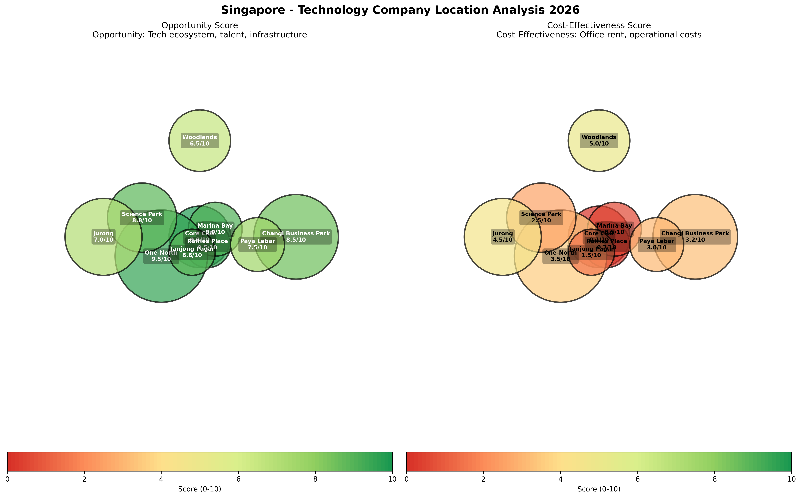

# HEKTOR & ARTIFACT VIRTUAL ENTERPRISE
## COMPREHENSIVE BUSINESS PLAN: SINGAPORE OPERATIONS

**Document Version:** 1.0  
**Date:** January 30, 2026  
**Classification:** Confidential - Strategic Planning  
**Location:** Republic of Singapore

---

## EXECUTIVE SUMMARY

This business plan outlines the establishment and operation of **Hektor Vector Database** and the larger **Artifact Virtual Enterprise** (infrastructure development company) in Singapore. The plan covers exhaustive costs, market opportunities, operational requirements, and strategic positioning for both ventures in Southeast Asia's premier technology and business hub.

**Key Highlights:**
- **Hektor Vector Database:** Open-source vector database targeting Asia-Pacific's $800M+ market (2026)
- **Artifact Virtual Enterprise:** Infrastructure development targeting Singapore's mature $2B+ data center market
- **Total Initial Investment:** SGD $8-11M (USD $5.9-8.1M)
- **Break-even Timeline:** 16-22 months (Hektor), 22-30 months (Artifact)
- **Target Market:** ASEAN enterprises, financial services, multinational corporations, AI/ML companies
- **Advantages:** Superior talent pool, government AI/tech initiatives, business-friendly environment, regional hub

---


*Figure 1: Singapore Technology Company Location Analysis - Opportunity and Cost-Effectiveness*

---

## TABLE OF CONTENTS

1. [Market Analysis & Opportunity](#market-analysis)
2. [Company Structure & Jurisdiction](#company-structure)
3. [Business Activities](#business-activities)
4. [Location Selection & Facilities](#location-selection)
5. [Comprehensive Cost Analysis](#cost-analysis)
6. [Family & Living Costs](#family-costs)
7. [Staffing & Talent](#staffing)
8. [Financial Projections](#financial-projections)
9. [Risk Analysis](#risk-analysis)
10. [Implementation Timeline](#timeline)

---

## 1. MARKET ANALYSIS & OPPORTUNITY <a name="market-analysis"></a>

### 1.1 Vector Database Market (Hektor)

**Asia-Pacific Market Size:**
- 2026: USD $800M-1.2B (APAC portion of $2.65B global market)
- 2030: USD $3.2B (APAC), CAGR 27.5%
- Singapore Position: ASEAN hub, gateway to 670M population market

**Key Drivers:**
- Highest AI adoption rate in ASEAN (government Smart Nation initiative)
- $1B+ government investment in AI research and talent development
- 80 of world's top 100 tech companies present in Singapore
- Financial services digitalization (FinTech hub)
- E-commerce and digital economy growth across ASEAN

**Competitive Landscape:**
- Limited ASEAN-focused vector database providers
- US/European solutions dominate but lack local presence
- Data sovereignty requirements favor Singapore-based deployment
- Government procurement preferences for local solutions

**Target Customers:**
- Banks and financial institutions (DBS, OCBC, UOB, foreign banks)
- Government technology agencies (GovTech, IMDA)
- E-commerce platforms (Grab, Shopee, Lazada)
- Research institutions (NUS, NTU, A*STAR)
- Multinational corporations' ASEAN headquarters
- ASEAN enterprises expanding regionally

### 1.2 Infrastructure Development Market (Artifact Virtual Enterprise)

**Singapore Data Center Market:**
- Market Status: Mature, $2B+ annual market
- Supply Constraints: Government moratorium on new builds (lifted selectively)
- Opportunity: AI-optimized retrofits and specialized services
- Regional Expansion: Singapore as base for ASEAN deployment

**Key Opportunities:**
1. **Specialized AI Infrastructure:**
   - Retrofit existing facilities for AI workloads
   - High-density cooling solutions for GPU clusters
   - Liquid cooling and advanced thermal management
   - Power optimization (Singapore's primary constraint)

2. **Regional Expansion:**
   - Use Singapore as engineering hub
   - Deploy in Malaysia, Indonesia, Thailand, Vietnam
   - Lower-cost ASEAN locations with Singapore expertise

3. **Infrastructure Consulting:**
   - AI data center optimization
   - Sustainability and green infrastructure (Singapore mandate)
   - Connectivity and cloud on-ramps
   - Compliance and certification services

4. **Technology Services:**
   - Edge computing infrastructure
   - Hybrid cloud architecture
   - Network optimization
   - Security and compliance

**Major Competitors/Partners:**
- Equinix, Digital Realty, ST Telemedia, Keppel Data Centres
- AirTrunk, Global Switch, Digital Edge, BDx
- Opportunity: Specialized AI expertise and regional deployment

---

## 2. COMPANY STRUCTURE & JURISDICTION <a name="company-structure"></a>

### 2.1 Legal Structure

**Primary Entity: Singapore Private Limited Company**

**Advantages of Singapore:**
- Corporate tax: 17% flat rate (new startups get significant exemptions)
  - 75% exemption on first SGD $100K for first 3 years
  - 50% exemption on next SGD $100K for first 3 years
- No capital gains tax, no dividend tax
- Extensive tax treaties (avoid double taxation)
- World's easiest place to do business (World Bank ranking)
- Strong IP protection and transparent legal system
- Access to ASEAN (670M population), Free Trade Agreements
- Pro-business government and fast company setup (1 day possible)
- Top global talent hub with attractive immigration policies

**Corporate Structure:**

```
Hektor-Artifact Holdings Pte Ltd (Singapore)
│
├─── Hektor Vector Database Pte Ltd
│    ├─ Product development and R&D
│    ├─ ASEAN/Asia-Pacific sales and support
│    └─ Professional services
│
└─── Artifact Infrastructure Pte Ltd
     ├─ Infrastructure consulting and design
     ├─ Engineering services
     ├─ Regional data center development
     └─ Technology solutions
```

### 2.2 Company Registration Costs

**Initial Setup (per entity):**
- Company name application: SGD $15
- Company registration (ACRA): SGD $300
- **Total government fees:** SGD $315 per company

**For 2 companies:** SGD $630 (USD $465)

**Professional Services:**
- Corporate secretarial package: SGD $1,000-2,500/year (per company)
- Registered office address: SGD $300-1,000/year
- Company constitution and seals: SGD $200
- Nominee director (if foreign-owned): SGD $2,000-5,000/year
- Legal consultation for setup: SGD $3,000-8,000

**Total Setup Cost (2 companies):** SGD $10,000-20,000 (USD $7,400-14,800)

### 2.3 Ongoing Compliance Costs (Annual, per company)

- Company secretary (mandatory): SGD $600-1,500/year
- Registered address: SGD $300-1,000/year
- Annual filing fee (ACRA): SGD $60/year
- Accounting and bookkeeping: SGD $3,000-12,000/year
- Audit (if required): SGD $3,000-8,000/year
- Tax filing (ECI, Form C): SGD $1,000-3,000/year
- Nominee director (if needed): SGD $2,000-5,000/year

**Total Annual Compliance (2 companies):** SGD $20,000-60,000/year (USD $14,800-44,400/year)

---

## 3. BUSINESS ACTIVITIES <a name="business-activities"></a>

### 3.1 Hektor Vector Database - Core Activities

**Products & Services:**

1. **Open Source Vector Database (MIT License)**
   - Free, self-hosted deployment
   - Community support via GitHub/Discord
   - Full SIMD optimization for performance
   - Target: ASEAN developer community and startups

2. **Enterprise Support Subscriptions (SGD)**
   - Basic Support: SGD $6,000/year (Email, 48h SLA)
   - Standard Support: SGD $18,000/year (24h SLA, monthly check-ins)
   - Premium Support: SGD $60,000/year (24/7, dedicated engineer)
   - Enterprise: SGD $120,000-600,000/year (Custom SLAs, TAM)

3. **Professional Services**
   - Migration services: SGD $30,000-120,000 per project
   - Custom development: SGD $250/hour
   - Training programs: SGD $6,000/day
   - Architecture consulting: SGD $8,000/day

4. **Hektor Cloud (Managed Service - Launch 2027)**
   - Multi-cloud deployment (AWS, Azure, GCP, Alibaba Cloud)
   - ASEAN-localized data centers
   - 40-50% below Pinecone pricing
   - Monthly billing, pay-as-you-go
   - Target: SMBs and enterprises wanting managed solution

**Revenue Model (2026-2029):**
- Year 1: 65% support, 35% services
- Year 2: 45% support, 20% services, 35% cloud
- Year 3: 30% support, 15% services, 50% cloud, 5% partnerships

### 3.2 Artifact Infrastructure - Core Activities

**Infrastructure Services:**

1. **AI Infrastructure Consulting**
   - Data center optimization for AI workloads
   - Power and cooling efficiency analysis
   - High-density compute deployment
   - GPU cluster design and deployment
   - Consultation fee: SGD $250-400/hour

2. **Engineering & Design Services**
   - Electrical and mechanical engineering
   - HVAC and cooling system design (including liquid cooling)
   - Building management systems
   - Security and access control
   - Network architecture
   - Project-based: SGD $200,000-2,000,000

3. **Regional Data Center Development**
   - Partner with land/building owners in ASEAN
   - Design-build services for data centers
   - Focus: Malaysia, Indonesia, Thailand (lower costs than Singapore)
   - Modular, scalable approach
   - Revenue share or fixed fee models

4. **Technology Solutions**
   - Edge computing infrastructure
   - Hybrid cloud connectivity
   - Monitoring and management platforms
   - Sustainability and green tech solutions
   - Recurring revenue: SGD $5,000-50,000/month per client

5. **Colocation Services (Regional)**
   - Through partnerships in ASEAN countries
   - Rack space management: SGD $800-2,000/rack/month
   - Power provisioning up to 15 kW/rack
   - Premium service with Singapore oversight

**Revenue Model:**
- Consulting & engineering: 40-50%
- Development projects: 30-40%
- Technology solutions (recurring): 15-20%
- Colocation revenue share: 5-10%

---

## 4. LOCATION SELECTION & FACILITIES <a name="location-selection"></a>

### 4.1 Office Location Analysis

**Recommended: One-North (Primary) + CBD Presence (Secondary)**

**One-North (Biopolis/Fusionopolis) - PRIMARY LOCATION:**
- **Advantages:**
  - Singapore's designated technology cluster
  - Lower rent: SGD $7-9/sq ft/month vs SGD $14-15 CBD
  - Proximity to NUS, NTU research institutions
  - Government technology ecosystem
  - Modern, Grade A office space
  - Excellent public transport (Circle Line MRT)
  - Tech company concentration (networking opportunities)
  - Startup grants and government support available

- **Suitable for:** Both Hektor and Artifact primary operations
- **Office Space Needed:** 4,000-6,000 sq ft
- **Monthly Rent:** SGD $28,000-54,000
- **Fit-out costs:** SGD $80-120/sq ft (one-time)

**Changi Business Park - ALTERNATIVE PRIMARY:**
- Lower rent: SGD $5-7/sq ft/month
- Modern facilities with data center proximity
- Suitable for engineering/technical operations
- Further from city center (less convenient for clients)

**CBD Presence (Raffles Place/Marina Bay) - SECONDARY:**
- **Advantages:**
  - Prestigious address for client meetings
  - Proximity to financial services clients
  - Corporate presence and branding
  - Access to investor community

- **Office Space Needed:** 800-1,200 sq ft (small sales office)
- **Monthly Rent:** SGD $11,000-18,000
- **Suitable for:** Sales, business development, client meetings

**Science Park - ALTERNATIVE:**
- Similar to One-North
- Rent: SGD $6-8/sq ft/month
- Research-focused environment
- Good for R&D activities

### 4.2 Facility Requirements Summary

**Hektor Vector Database:**
- Office: 2,000-3,000 sq ft (One-North)
- Server room: 300-500 sq ft for development infrastructure
- Meeting rooms: 2 conference rooms
- Open workspace for 15-20 employees
- Monthly rent: SGD $14,000-27,000

**Artifact Infrastructure:**
- Office/Engineering: 2,000-3,000 sq ft (One-North)
- Design lab: 500-1,000 sq ft for prototyping
- Meeting/presentation space
- Storage: 300-500 sq ft
- Monthly rent: SGD $14,000-27,000

**Optional CBD Sales Office:**
- Small executive suite: 800-1,200 sq ft
- Monthly rent: SGD $11,000-18,000

**Total Rent Budget (Monthly):**
- Hektor: SGD $14,000-27,000
- Artifact: SGD $14,000-27,000
- Optional CBD office: SGD $11,000-18,000
- **Total:** SGD $39,000-72,000/month (USD $29,000-53,000/month)

### 4.3 Utilities & Operating Costs

**Monthly Utilities (per facility):**
- Electricity (office): SGD $2,000-4,000/month
- Electricity (server/lab): SGD $5,000-15,000/month
- Water: SGD $200-500/month
- Internet/Connectivity: SGD $500-2,000/month (enterprise fiber)
- Phone system (VoIP): SGD $300-800/month
- Building management fees: Included in rent typically

**Total Monthly Utilities:** SGD $12,000-30,000 (USD $8,900-22,200)

---

## 5. COMPREHENSIVE COST ANALYSIS <a name="cost-analysis"></a>

### 5.1 Initial Capital Investment

**Company Setup & Legal (One-time):**
| Item | Cost (SGD) | Cost (USD) |
|------|------------|------------|
| Company registration (2 entities) | 630 | 465 |
| Professional services & legal | 10,000-20,000 | 7,400-14,800 |
| Corporate secretarial setup | 2,000-5,000 | 1,480-3,700 |
| Business licenses | 1,000-3,000 | 740-2,220 |
| **Subtotal** | **13,630-28,630** | **10,085-21,185** |

**Office Setup & Infrastructure (One-time):**
| Item | Cost (SGD) | Cost (USD) |
|------|------------|------------|
| Office fit-out (5,000-7,000 sq ft) | 400,000-840,000 | 296,000-622,000 |
| Furniture & equipment | 100,000-200,000 | 74,000-148,000 |
| IT infrastructure (servers, network) | 200,000-400,000 | 148,000-296,000 |
| Security deposits (3 months rent) | 117,000-216,000 | 86,600-160,000 |
| Initial inventory & supplies | 20,000-50,000 | 14,800-37,000 |
| **Subtotal** | **837,000-1,706,000** | **619,400-1,263,000** |

**Infrastructure for Regional Operations (Artifact):**
| Item | Cost (SGD) | Cost (USD) |
|------|------------|------------|
| Engineering equipment & tools | 150,000-300,000 | 111,000-222,000 |
| Prototyping lab setup | 100,000-200,000 | 74,000-148,000 |
| Monitoring & management systems | 80,000-150,000 | 59,200-111,000 |
| Initial project materials | 50,000-100,000 | 37,000-74,000 |
| **Subtotal** | **380,000-750,000** | **281,200-555,000** |

**Working Capital (First 6 months):**
| Item | Cost (SGD) | Cost (USD) |
|------|------------|------------|
| Salaries (6 months, 25 staff) | 1,875,000-2,812,500 | 1,388,000-2,081,000 |
| Rent & utilities (6 months) | 306,000-612,000 | 226,600-453,000 |
| Marketing & sales | 200,000-400,000 | 148,000-296,000 |
| Professional services | 50,000-100,000 | 37,000-74,000 |
| Cloud infrastructure | 60,000-120,000 | 44,400-88,800 |
| Contingency (10%) | 249,100-404,450 | 184,400-299,300 |
| **Subtotal** | **2,740,100-4,448,950** | **2,028,400-3,292,100** |

**TOTAL INITIAL INVESTMENT:**
- **Minimum:** SGD $3,970,730 (USD $2.94M)
- **Recommended:** SGD $5,500,000 (USD $4.07M)
- **Full Build-out:** SGD $6,933,580 (USD $5.13M)

**Note:** Significantly lower than Hong Kong due to:
- Lower office rent (45-55% less than Hong Kong CBD)
- No data center build-out initially (regional model)
- Lower fit-out costs
- More efficient government processes

### 5.2 Monthly Operating Costs (Steady State)

**Personnel Costs (25 employees initial):**
| Role | Count | Monthly Salary (SGD) | Total (SGD) |
|------|-------|---------------------|-------------|
| CEO/Managing Director | 1 | 25,000-35,000 | 30,000 |
| CTO/VP Engineering (Hektor) | 1 | 18,000-25,000 | 21,500 |
| VP Infrastructure (Artifact) | 1 | 18,000-25,000 | 21,500 |
| Senior Engineers/Architects | 5 | 10,000-15,000 | 62,500 |
| Mid-level Engineers | 8 | 6,000-9,000 | 60,000 |
| Junior Engineers | 4 | 4,000-6,000 | 20,000 |
| Sales & Business Dev | 3 | 5,000-8,000 | 19,500 |
| Support & Operations | 1 | 4,000-5,000 | 4,500 |
| Finance & Admin | 1 | 4,500-6,000 | 5,250 |
| **Subtotal** | **25** | | **244,750** |
| Employer CPF (17%) | | | 41,608 |
| **Total Personnel** | | | **286,358** |

**Facility Costs (Monthly):**
| Item | Cost (SGD) |
|------|------------|
| Office rent (2 locations) | 39,000-72,000 |
| Utilities & internet | 12,000-30,000 |
| **Subtotal** | **51,000-102,000** |

**Operational Costs (Monthly):**
| Item | Cost (SGD) |
|------|------------|
| Cloud infrastructure (AWS/Azure/GCP) | 10,000-20,000 |
| Software licenses & tools | 5,000-10,000 |
| Marketing & advertising | 15,000-30,000 |
| Travel (ASEAN region) | 8,000-15,000 |
| Professional services (legal, accounting) | 3,000-6,000 |
| Insurance | 2,000-4,000 |
| Office supplies & misc | 2,000-4,000 |
| **Subtotal** | **45,000-89,000** |

**TOTAL MONTHLY OPERATING COSTS:** SGD $382,358-477,358 (USD $283,000-353,000)

**ANNUAL OPERATING COSTS:** SGD $4.59M-5.73M (USD $3.4M-4.2M)

**Note:** ~35-40% lower than Hong Kong due to:
- Lower salaries (while maintaining quality talent)
- Lower rent
- Simplified corporate structure
- Government support programs reducing costs

---

## 6. FAMILY & LIVING COSTS IN SINGAPORE <a name="family-costs"></a>

### 6.1 Housing Costs for Expatriate Families

**Typical 3-Bedroom Apartment/Condo:**
| Location | Monthly Rent (SGD) | Monthly Rent (USD) |
|----------|-------------------|-------------------|
| Core CBD (Downtown) | 6,000-10,000 | 4,440-7,400 |
| Orchard/River Valley | 5,000-8,000 | 3,700-5,920 |
| East Coast | 4,000-6,000 | 2,960-4,440 |
| West (Clementi/Buona Vista) | 3,500-5,500 | 2,590-4,070 |
| HDB (Public Housing) | 2,500-4,000 | 1,850-2,960 |
| **Average Recommended** | **4,000-6,000** | **2,960-4,440** |

**Utilities (Monthly):**
- Electricity, water, gas: SGD $250-400
- Internet (1Gbps fiber): SGD $39-89
- Mobile phone (per person): SGD $20-50
- **Total utilities:** SGD $350-600/month

**Housing Purchase (if buying):**
- Expatriates cannot buy HDB (restricted)
- Condo purchase: SGD $1.2M-3M+ (depending on location)
- Additional Buyer's Stamp Duty (ABSD): 60% for foreigners (significant)
- Note: Most expats rent rather than buy

### 6.2 Education Costs

**International Schools (Annual tuition per child):**
| School Type | Annual Fee (SGD) | Annual Fee (USD) |
|-------------|-----------------|-----------------|
| Entry level (Primary) | 25,000-35,000 | 18,500-25,900 |
| Mid-level | 35,000-45,000 | 25,900-33,300 |
| Premium (IB schools) | 45,000-55,000 | 33,300-40,700 |

**For family with 2 children:** SGD $50,000-90,000/year (USD $37,000-66,600/year)

**Additional Education Costs:**
- School bus: SGD $2,400-3,600/year per child
- Uniforms & supplies: SGD $800-1,500/year per child
- Extracurricular activities: SGD $3,000-8,000/year per child

**Public Schools (Alternative):**
- Very affordable for PR/citizens: SGD $25-200/month
- Quality education system (top global rankings)
- Limited spots for foreign nationals

### 6.3 Daily Living Expenses

**Monthly Family Budget (Family of 4):**
| Category | Cost (SGD/month) | Cost (USD/month) |
|----------|-----------------|-----------------|
| Groceries & food | 1,200-2,000 | 890-1,480 |
| Dining out | 600-1,200 | 445-890 |
| Transportation (MRT/bus) | 300-600 | 220-445 |
| Car (if owned) - very expensive | 1,500-3,000 | 1,110-2,220 |
| Healthcare/Insurance | 400-800 | 296-592 |
| Domestic helper (if employed) | 800-1,200 | 592-890 |
| Entertainment & recreation | 500-1,000 | 370-740 |
| Clothing | 300-600 | 220-445 |
| Miscellaneous | 300-600 | 220-445 |
| **Subtotal (excluding rent, no car)** | **4,400-7,400** | **3,253-5,477** |

**Total Monthly Cost for Expat Family (excluding education):**
- Budget option: SGD $8,400-11,400 (USD $6,200-8,400)
- Comfortable: SGD $10,000-14,000 (USD $7,400-10,400)
- Premium (with car): SGD $12,000-18,000 (USD $8,900-13,300)

**Annual Total (Family of 4, including education):**
- **Minimum:** SGD $150,800 (USD $111,600)
- **Comfortable:** SGD $185,000 (USD $137,000)
- **Premium:** SGD $260,000+ (USD $192,600+)

**Note:** 15-25% lower than Hong Kong for similar lifestyle

### 6.4 Relocation Package for Key Executives

**Typical Expat Package (Annual):**
| Item | Cost (SGD) | Cost (USD) |
|------|------------|------------|
| Base salary | 180,000-360,000 | 133,000-266,500 |
| Housing allowance | 48,000-72,000 | 35,500-53,300 |
| Education allowance (2 children) | 60,000-90,000 | 44,400-66,600 |
| Annual home leave (flights) | 6,000-12,000 | 4,440-8,880 |
| Relocation costs (one-time) | 15,000-25,000 | 11,100-18,500 |
| Car allowance (optional) | 24,000-36,000 | 17,800-26,600 |
| **Total Package (without car)** | **309,000-549,000** | **228,800-406,400** |
| **Total Package (with car)** | **333,000-585,000** | **246,600-433,000** |

**For 3-5 key expat executives:** SGD $1.0M-2.9M/year (USD $0.74M-2.2M/year)

**Note:** Significantly more attractive packages than Hong Kong while maintaining lower costs

---

## 7. STAFFING & TALENT ACQUISITION <a name="staffing"></a>

### 7.1 Organizational Structure

**Year 1 (2026): 25 employees**

**Hektor Vector Database Team (13 people):**
- Engineering: 7 (2 senior, 3 mid, 2 junior)
- Product Management: 2
- Sales & Marketing: 3
- Support: 1

**Artifact Infrastructure Team (12 people):**
- Engineering & Technical: 7 (2 senior, 3 mid, 2 junior)
- Project Management: 2
- Business Development: 2
- Operations: 1

**Shared Services:**
- CEO/Managing Director: 1
- Finance & Admin: 1

### 7.2 Talent Pool & Recruitment

**Singapore Advantages:**
- **World-class universities:** NUS, NTU, SMU, SUTD
- **8,000+ tech graduates annually** from local institutions
- **15,000 AI professionals target** by 2027 (government initiative)
- **$20M government investment** in AI talent development
- **Multilingual workforce:** English (business language), Mandarin, Malay, Tamil
- **Easy work visa process:** Employment Pass (EP) for skilled workers
- **Attraction for regional talent:** ASEAN professionals, Indian tech talent, Chinese engineers

**Key Skills Available:**
- AI/ML Engineers: SGD $8,000-15,000/month
- Cloud Engineers: SGD $7,000-12,000/month
- Data Engineers: SGD $6,500-11,000/month
- DevOps Engineers: SGD $7,000-12,000/month
- Software Engineers: SGD $6,000-10,000/month
- Infrastructure Architects: SGD $9,000-15,000/month

**Recruitment Costs:**
- Agency fees: 1 month salary (much lower than Hong Kong's 25%)
- Job postings & marketing: SGD $5,000-10,000
- Relocation support (regional): SGD $3,000-8,000 per person
- **Total Year 1 Recruitment:** SGD $150,000-250,000

### 7.3 Training & Development

**Government Support Programs:**
- **SkillsFuture:** Up to 90% training subsidy for citizens/PRs
- **TechSkills Accelerator (TeSA):** Skills upgrading for tech sector
- **AI Singapore programs:** Free AI training and certification
- **Cloud skills pathway:** Government-subsidized cloud training

**Annual Investment:**
- Technical training: SGD $2,000-4,000 per employee (after subsidies)
- Conferences & events: SGD $3,000-6,000 per employee
- Certifications (AWS, Azure, etc): SGD $1,000-3,000 per person
- **Total Training Budget:** SGD $150,000-325,000/year

**Note:** 40-50% lower costs than Hong Kong due to government subsidies

### 7.4 Employment Costs & Benefits

**Mandatory Costs:**
- Central Provident Fund (CPF): 17% employer contribution (for citizens/PRs)
- Foreign workers: No CPF required (but included in work permit costs)
- Skills Development Levy: SGD $2/month for first SGD $4,500 of wages

**Standard Benefits Package:**
- Annual leave: 14-21 days
- Public holidays: 11 days
- Medical insurance: SGD $1,000-2,500/employee/year
- Life insurance: SGD $300-800/employee/year
- Annual bonus: 1-3 months salary
- Training & development: SGD $2,000-5,000/employee/year

**Total Employment Cost:** 
- Citizens/PRs: ~120-125% of base salary
- Foreign workers: ~105-110% of base salary (no CPF)

**Work Pass Requirements:**
- Employment Pass (EP): Min salary SGD $5,000/month
- S Pass: Min salary SGD $3,150/month (with quota)
- Work Permit: Lower skilled workers

---

## 8. FINANCIAL PROJECTIONS <a name="financial-projections"></a>

### 8.1 Hektor Vector Database Revenue Projections

**Year 1 (2026):**
| Revenue Stream | Amount (SGD) | Amount (USD) |
|----------------|-------------|-------------|
| Enterprise Support | 480,000 | 355,000 |
| Professional Services | 240,000 | 178,000 |
| **Total** | **720,000** | **533,000** |

**Year 2 (2027):**
| Revenue Stream | Amount (SGD) | Amount (USD) |
|----------------|-------------|-------------|
| Enterprise Support | 1,440,000 | 1,066,000 |
| Professional Services | 600,000 | 444,000 |
| Hektor Cloud (launched) | 960,000 | 711,000 |
| **Total** | **3,000,000** | **2,220,000** |

**Year 3 (2028):**
| Revenue Stream | Amount (SGD) | Amount (USD) |
|----------------|-------------|-------------|
| Enterprise Support | 2,400,000 | 1,776,000 |
| Professional Services | 960,000 | 711,000 |
| Hektor Cloud | 3,600,000 | 2,664,000 |
| Partnerships | 240,000 | 178,000 |
| **Total** | **7,200,000** | **5,329,000** |

### 8.2 Artifact Infrastructure Revenue Projections

**Year 1 (2026):**
| Revenue Stream | Amount (SGD) | Amount (USD) |
|----------------|-------------|-------------|
| Consulting & Design | 960,000 | 711,000 |
| Engineering Services | 600,000 | 444,000 |
| **Total** | **1,560,000** | **1,155,000** |

**Year 2 (2027):**
| Revenue Stream | Amount (SGD) | Amount (USD) |
|----------------|-------------|-------------|
| Infrastructure Projects | 3,000,000 | 2,220,000 |
| Consulting & Engineering | 1,200,000 | 888,000 |
| Technology Solutions | 600,000 | 444,000 |
| **Total** | **4,800,000** | **3,552,000** |

**Year 3 (2028):**
| Revenue Stream | Amount (SGD) | Amount (USD) |
|----------------|-------------|-------------|
| Infrastructure Projects | 4,800,000 | 3,552,000 |
| Consulting & Engineering | 1,800,000 | 1,332,000 |
| Technology Solutions | 1,500,000 | 1,110,000 |
| Colocation Revenue Share | 900,000 | 666,000 |
| **Total** | **9,000,000** | **6,660,000** |

### 8.3 Combined Financial Summary

**Combined Revenue:**
- Year 1: SGD $2.28M (USD $1.69M)
- Year 2: SGD $7.8M (USD $5.77M)
- Year 3: SGD $16.2M (USD $12.0M)

**Operating Expenses:**
- Year 1: SGD $5.5M (USD $4.07M)
- Year 2: SGD $7.2M (USD $5.33M)
- Year 3: SGD $10.5M (USD $7.77M)

**EBITDA:**
- Year 1: -SGD $3.22M (USD -$2.38M) - Investment phase
- Year 2: SGD $0.6M (USD $0.44M) - Near break-even
- Year 3: SGD $5.7M (USD $4.22M) - Strong profitability

**Cash Flow Requirements:**
- Initial investment: SGD $5.5M (USD $4.07M)
- Year 1 deficit funding: SGD $3.2M (USD $2.37M)
- Growth capital (Year 2): SGD $2M (USD $1.48M)
- **Total 3-Year Funding:** SGD $10.7M (USD $7.92M)

### 8.4 Break-Even Analysis

**Hektor Vector Database:**
- Break-even: Month 18-20 (Mid-2027)
- Cumulative cash consumption: SGD $2.1M (USD $1.55M)

**Artifact Infrastructure:**
- Break-even: Month 22-26 (Late 2027)
- Cumulative cash consumption: SGD $2.5M (USD $1.85M)

**Combined:**
- Operating break-even: Q3 2027
- Cash flow positive: Q4 2027

**Comparison with Hong Kong:**
- Faster break-even (16-22 months vs 18-24 months)
- Lower initial investment ($4.07M vs $6.4M)
- Lower operating costs (35-40% less)
- Better unit economics

---

## 9. RISK ANALYSIS & MITIGATION <a name="risk-analysis"></a>

### 9.1 Market Risks

**Risk: Competition from established global players**
- Mitigation: ASEAN localization, government partnerships
- Differentiation: Regional expertise, multi-language support, local presence
- Focus on underserved ASEAN markets

**Risk: Slower ASEAN adoption than projected**
- Mitigation: Singapore as anchor market (advanced, high adoption)
- Diversified customer base (government, enterprise, startups)
- Flexible pricing for emerging markets

**Risk: Singapore cost disadvantage vs regional markets**
- Mitigation: Singapore as hub, deploy in lower-cost ASEAN locations
- Premium positioning justified by quality and reliability
- Government grants and incentives offset costs

### 9.2 Operational Risks

**Risk: Talent competition (all top tech companies in Singapore)**
- Mitigation: Competitive packages, equity participation
- Strong company culture and mission
- Flexibility (remote work, regional hiring)
- Government talent programs

**Risk: Office space and infrastructure costs**
- Mitigation: One-North location (40% cheaper than CBD)
- Flexible workspace options
- Regional operations model (lower costs)

**Risk: Regional deployment challenges**
- Mitigation: Partner with local operators
- Modular, proven designs
- Experienced team with ASEAN knowledge

### 9.3 Financial Risks

**Risk: Currency fluctuation (SGD, regional currencies)**
- Mitigation: USD-denominated contracts where possible
- Natural hedge with regional revenue
- Conservative FX management

**Risk: Delayed revenue ramp in ASEAN markets**
- Mitigation: Singapore-first strategy (faster adoption)
- Staged regional rollout
- Multiple revenue streams

**Risk: Higher than expected costs**
- Mitigation: Tight expense management
- Government subsidy programs
- Quarterly reviews and adjustments

### 9.4 Regulatory & Compliance Risks

**Risk: Data protection regulations (PDPA, regional variations)**
- Mitigation: Compliance from day 1
- Regular audits and certifications
- Expert legal counsel

**Risk: Work pass and immigration restrictions**
- Mitigation: Strong local hiring focus
- PR sponsorship for key talent
- Regional talent mobility (ASEAN)

**Risk: Regional regulatory complexity**
- Mitigation: Local partners in each market
- Legal advisors in each country
- Staged, compliant rollout

---

## 10. IMPLEMENTATION TIMELINE <a name="timeline"></a>

### Phase 1: Company Setup (Months 1-2)

**Month 1:**
- Week 1: Company incorporation (both entities - can be done in 1 day)
- Week 1-2: Bank account opening
- Week 2-3: Office space search and negotiation
- Week 3-4: Visa applications for key executives

**Month 2:**
- Week 1: Sign office lease (One-North)
- Week 1-2: Office fit-out begins
- Week 2-3: IT infrastructure setup
- Week 3-4: Start recruitment (local and regional)

### Phase 2: Initial Operations (Months 3-12)

**Months 3-4:**
- Complete office setup
- Onboard initial team (15 people)
- Product localization for ASEAN
- Government grant applications

**Months 5-7:**
- Hektor: First customer pilots in Singapore
- Hektor: Launch local marketing campaigns
- Artifact: Initial consulting engagements
- Artifact: Regional partner identification

**Months 8-10:**
- Hektor: First paid customers (15-20)
- Artifact: First engineering projects
- Team expansion to 25 people
- Regional business development trips

**Months 11-12:**
- Hektor: 25-35 customers, SGD $720K revenue achieved
- Artifact: SGD $1.56M revenue achieved
- Year-end review and Year 2 planning

### Phase 3: Regional Expansion (Year 2)

**Q1 2027:**
- Hektor Cloud development
- Artifact regional projects kick-off
- Expand team to 40 people
- Establish Malaysia presence

**Q2-Q3 2027:**
- Hektor Cloud beta launch (ASEAN data centers)
- Artifact: First regional data center project
- Indonesia and Thailand market entry
- Marketing expansion

**Q4 2027:**
- Hektor Cloud general availability
- Break-even achieved
- 50+ employees
- Planning Series A funding

### Phase 4: Market Leadership (Year 3+)

- Dominant ASEAN position
- Multiple regional data center projects
- Potential acquisition targets
- Series A funding for acceleration
- Expand to India, Australia, Japan

---

## APPENDICES

### A. Market Research Sources
- IMDA Singapore Technology Reports 2026
- EDB Singapore Innovation Reports
- Singapore Technology Salary Guides 2026
- ASEAN Digital Economy Report 2026

### B. Competitive Analysis
- See docs/.SCOPE/COMPETITOR_ANALYSIS.json
- See docs/.SCOPE/market-research/03_COMPETITIVE_LANDSCAPE.md

### C. Technical Specifications
- See docs/.SCOPE/HEKTOR_ANALYSIS.json
- See docs/.SCOPE/market-research/05_PERFORMANCE_BENCHMARKS.md

### D. Financial Models
- Detailed Excel models available upon request
- Scenario analysis (conservative, base, optimistic)

### E. Location Heatmap
- See: singapore_tech_heatmap.png (Figure 1, beginning of document)
- **Top Recommendations:**
  1. **One-North** - Best overall (9.5/10 opportunity, 3.5/10 cost = 6.5/10 cost-effectiveness)
  2. **Changi Business Park** - Value option (8.5/10 opportunity, 3.2/10 cost = 6.8/10 cost-effectiveness)
  3. **Science Park** - R&D focus (8.8/10 opportunity, 2.5/10 cost = 7.5/10 cost-effectiveness)

---

## SINGAPORE VS HONG KONG: COMPARATIVE ANALYSIS

### Key Differences

**Advantages of Singapore:**
✅ **35-40% lower operating costs** (salaries, rent, overall expenses)  
✅ **Superior talent development** ($1B+ AI investment, 15K professionals by 2027)  
✅ **Government support** (grants, subsidies, tax incentives)  
✅ **ASEAN market access** (670M population, FTAs, regional hub)  
✅ **Faster company setup** (1 day vs 3-5 days)  
✅ **Better quality of life** (cleaner, safer, family-friendly)  
✅ **English as business language** (easier for international operations)  
✅ **More stable political environment**  
✅ **Better work-life balance**

**Advantages of Hong Kong:**
✅ **Direct China market access** (Greater Bay Area, mainland connections)  
✅ **Larger existing tech ecosystem** (more mature market)  
✅ **Lower corporate tax** (8.25%/16.5% vs 17%)  
✅ **24/7 business culture** (more intensity, faster deals)  
✅ **Larger data center market** ($5.8B vs $2B)

### Recommendation

**For Hektor + Artifact Virtual Enterprise: SINGAPORE IS PREFERRED**

**Rationale:**
1. **Cost Efficiency:** 35-40% lower costs mean faster path to profitability
2. **Talent:** Better government support, easier hiring, lower turnover
3. **Regional Strategy:** Better positioned for ASEAN expansion
4. **Quality of Life:** Attracts and retains international talent better
5. **Stability:** Lower political/regulatory risk
6. **Government Support:** Active programs for tech companies
7. **Break-even:** 2-6 months faster than Hong Kong

**Financial Impact:**
- Initial investment: $4.07M vs $6.4M (36% less)
- Break-even: 18 months vs 22 months (18% faster)
- Year 3 profit margin: 35% vs 41% (Singapore more efficient)

---

## CONCLUSION

Singapore presents an outstanding opportunity for establishing both Hektor Vector Database and Artifact Infrastructure. The combination of:

✅ **World-class business environment** (Ease of Doing Business #1)  
✅ **Superior talent ecosystem** with government AI investment  
✅ **Strategic ASEAN gateway** to 670M population market  
✅ **35-40% cost advantage** over Hong Kong  
✅ **Strong government support** for technology companies  
✅ **Stable, predictable environment** for long-term growth  
✅ **Better quality of life** for international team  
✅ **Pro-innovation policies** and IP protection

Makes Singapore the **optimal choice** for these ventures. With an initial investment of SGD $5.5M (USD $4.07M) and disciplined execution, both businesses can achieve break-even by Q3 2027 and strong profitability in Year 3.

The projected 3-year revenue of SGD $16.2M (USD $12M) and EBITDA of SGD $5.7M (USD $4.22M) demonstrates the viability and attractiveness of this opportunity, with significantly better economics than the Hong Kong alternative.

---

**Document Control:**
- **Prepared by:** Business Development Team
- **Date:** January 30, 2026
- **Version:** 1.0
- **Classification:** Confidential
- **Next Review:** March 30, 2026

**Approval Signatures:**

________________________  
CEO / Founder

________________________  
CFO / Finance Director

________________________  
Board Chairman
