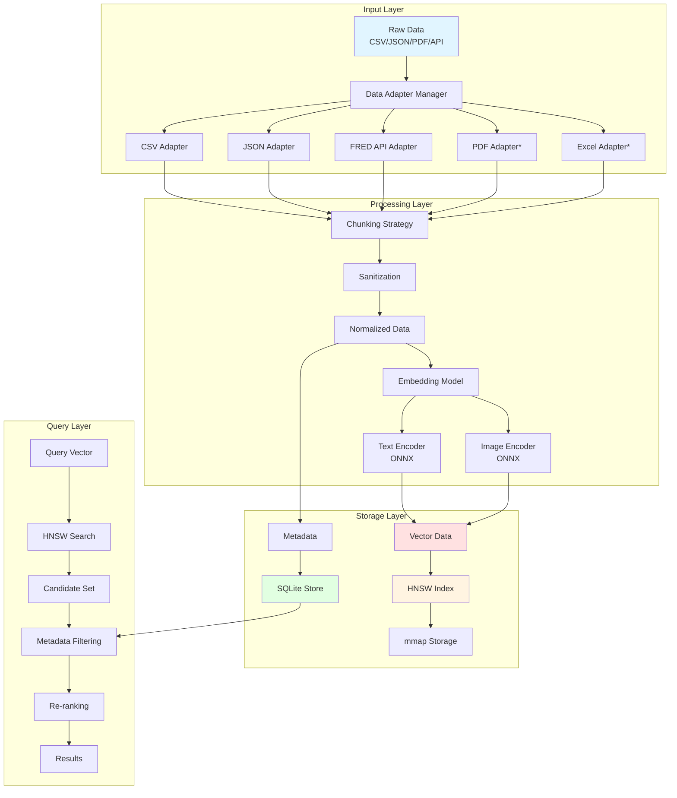
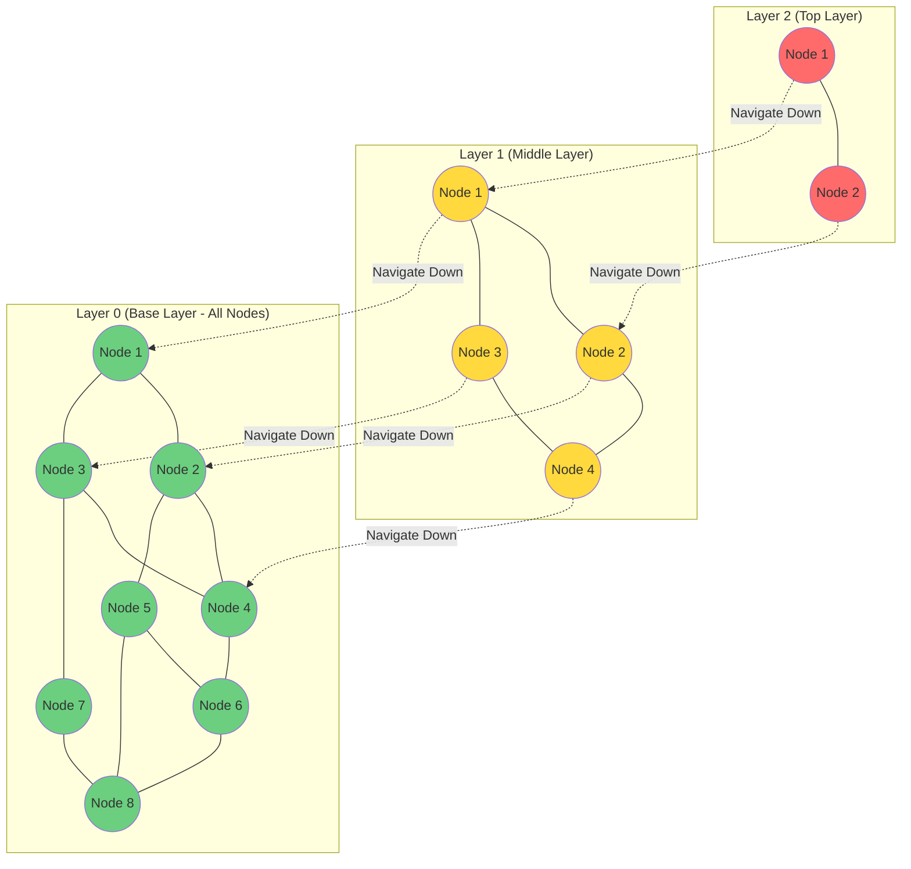
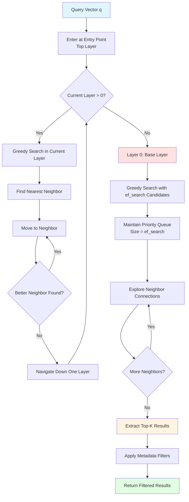
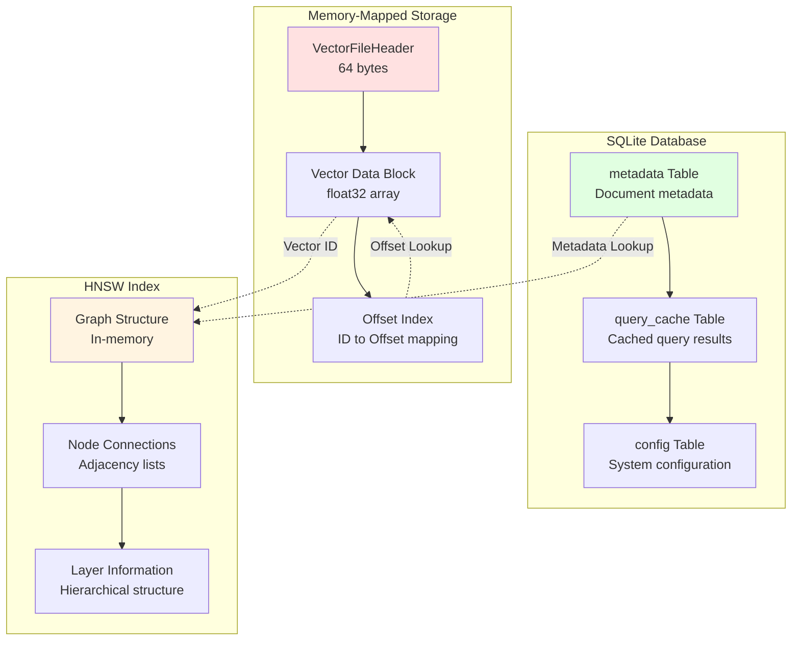
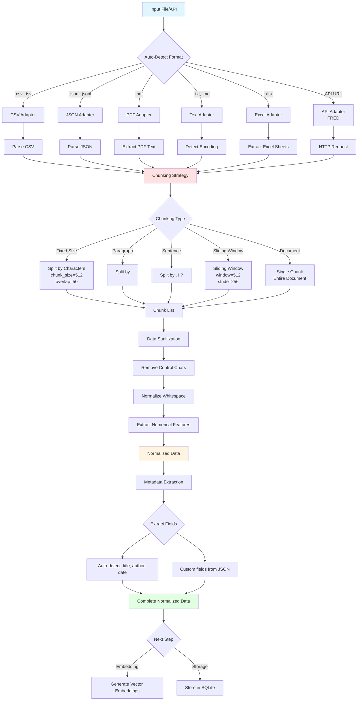
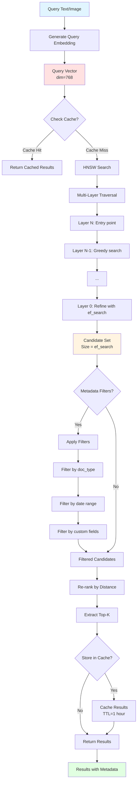
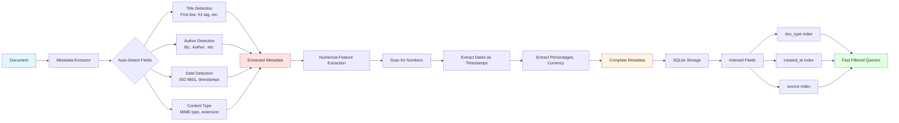
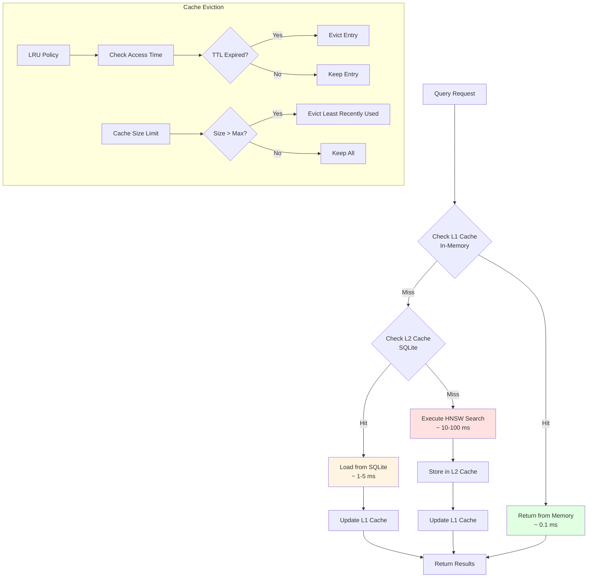
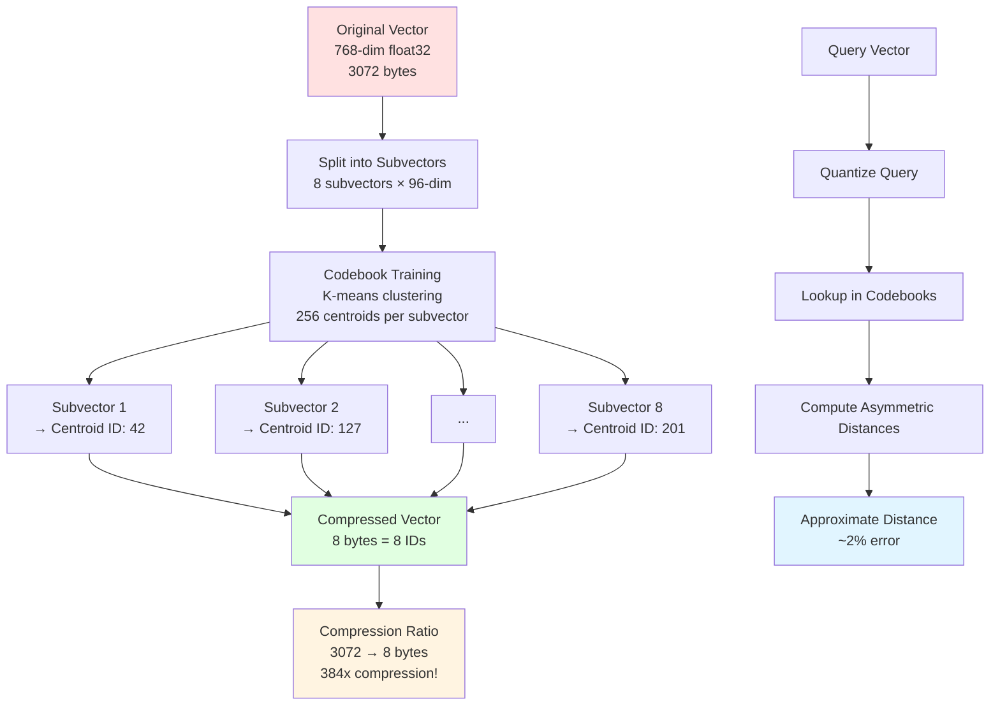

# VECTOR STUDIO
> Technical Architecture

**A comprehensive technical guide to Vector Studio's data structures, algorithms, and data requirements.**

---

## Table of Contents

1. [System Architecture Overview](#system-architecture-overview)
2. [Data Types & Formats](#data-types--formats)
3. [Vector Embeddings Pipeline](#vector-embeddings-pipeline)
4. [HNSW Index Algorithm](#hnsw-index-algorithm)
5. [Storage Architecture](#storage-architecture)
6. [Data Ingestion Pipeline](#data-ingestion-pipeline)
7. [Query Processing](#query-processing)
8. [Metadata System](#metadata-system)
9. [Caching & Performance](#caching--performance)
10. [Quantization (Planned)](#quantization-planned)

---

## System Architecture Overview



**Legend:**
- 🔵 Input/Output Components
- 🔴 Vector Processing
- 🟡 Indexing Components
- 🟢 Storage Components

---

## Data Types & Formats

### Accepted Input Formats

| Format | Extension | Adapter | Status | Required Fields |
|--------|-----------|---------|--------|-----------------|
| **CSV** | `.csv`, `.tsv` | CSVAdapter | ✅ Production | Headers optional, configurable delimiter |
| **JSON** | `.json` | JSONAdapter | ✅ Production | Valid JSON object or array |
| **JSONL** | `.jsonl`, `.ndjson` | JSONAdapter | ✅ Production | One JSON object per line |
| **PDF** | `.pdf` | PDFAdapter | 🔄 Planned | Valid PDF structure |
| **Plain Text** | `.txt`, `.md` | TextAdapter | 🔄 Planned | Valid text encoding |
| **Excel** | `.xlsx`, `.xls` | ExcelAdapter | 🔄 Planned | Valid Excel workbook |
| **API (FRED)** | N/A | FREDAdapter | ✅ Production | `api_key`, `series_id` |

### Vector Data Structure

```cpp
struct Vector {
    std::vector<float> data;      // Dense float32 vector
    size_t dimension;              // Vector dimensionality
    
    // Constraints:
    // - dimension: 128, 256, 384, 512, 768, 1024, 1536 (typical)
    // - data.size() == dimension
    // - L2 normalized: ||v|| = 1.0 (optional but recommended)
};
```

### Metadata Schema

```cpp
struct Metadata {
    // Required Fields
    std::string id;                           // Unique document identifier
    std::string content;                      // Original text content
    
    // Optional Fields (Indexed for Fast Filtering)
    std::optional<std::string> title;         // Document title
    std::optional<std::string> author;        // Document author
    std::optional<std::string> source;        // Data source
    std::optional<std::string> content_type;  // MIME type
    std::optional<Timestamp> created_at;      // Creation timestamp
    std::optional<Timestamp> updated_at;      // Last update timestamp
    
    // Document Type (Enum)
    DocumentType doc_type;                    // Article, Report, Email, etc.
    
    // Custom Fields (JSON)
    std::unordered_map<std::string, std::string> custom_fields;
    
    // Numerical Features (Auto-extracted)
    std::vector<double> numerical_features;   // Auto-detected numbers
};
```

**DocumentType Enum:**
```cpp
enum class DocumentType {
    Article,      // News articles, blog posts
    Report,       // Financial reports, research
    Email,        // Email messages
    Chat,         // Chat messages
    Code,         // Source code files
    PreMarket,    // Pre-market financial data
    PostMarket,   // Post-market financial data
    Intraday,     // Intraday financial data
    Unknown       // Unknown or unclassified
};
```

---

## Vector Embeddings Pipeline

```mermaid
flowchart TD
    A[Input Text/Image] --> B{Data Type?}
    B -->|Text| C[Text Preprocessing]
    B -->|Image| D[Image Preprocessing]
    
    C --> C1[Tokenization]
    C1 --> C2[Token Normalization]
    C2 --> C3[Truncate/Pad<br/>max_length=512]
    
    D --> D1[Resize<br/>224x224 or 384x384]
    D1 --> D2[Normalize<br/>mean=[0.485,0.456,0.406]<br/>std=[0.229,0.224,0.225]]
    D2 --> D3[Convert to Tensor]
    
    C3 --> E[ONNX Runtime]
    D3 --> E
    
    E --> F{Model Type}
    F -->|Text| G[Text Encoder<br/>BERT/RoBERTa/etc]
    F -->|Image| H[Image Encoder<br/>ResNet/ViT/etc]
    
    G --> I[Pooling Strategy]
    H --> I
    
    I --> I1{Pooling Type}
    I1 -->|Mean| J1[Mean Pooling]
    I1 -->|CLS| J2[CLS Token]
    I1 -->|Max| J3[Max Pooling]
    
    J1 --> K[Raw Embeddings<br/>dim=768]
    J2 --> K
    J3 --> K
    
    K --> L{Normalize?}
    L -->|Yes| M[L2 Normalization<br/>||v|| = 1.0]
    L -->|No| N[Raw Vector]
    
    M --> O[Final Embedding]
    N --> O
    
    O --> P[Store in Index]
    
    style A fill:#e1f5ff
    style E fill:#ffe1e1
    style O fill:#e1ffe1
```

### Embedding Model Requirements

**Text Encoder:**
```yaml
Model Format: ONNX
Input Shape: [batch_size, sequence_length]
Output Shape: [batch_size, hidden_dim]
Supported Dimensions: 128, 256, 384, 512, 768, 1024, 1536
Max Sequence Length: 512 tokens (configurable)
Tokenizer: WordPiece, SentencePiece, or BPE
```

**Image Encoder:**
```yaml
Model Format: ONNX
Input Shape: [batch_size, 3, height, width]
Output Shape: [batch_size, embedding_dim]
Supported Dimensions: 512, 768, 1024, 2048
Image Size: 224x224, 384x384, or 512x512
Normalization: ImageNet statistics
```

### Configuration Example

```cpp
// Text Encoder Configuration
TextEncoderConfig text_config;
text_config.model_path = "models/text_encoder.onnx";
text_config.tokenizer_path = "models/tokenizer.json";
text_config.max_length = 512;
text_config.pooling = PoolingStrategy::Mean;
text_config.normalize = true;  // L2 normalize output
text_config.device = Device::CPU;  // or Device::CUDA

// Image Encoder Configuration
ImageEncoderConfig image_config;
image_config.model_path = "models/image_encoder.onnx";
image_config.image_size = 224;
image_config.normalize = true;
image_config.device = Device::CPU;
```

---

## HNSW Index Algorithm

### Hierarchical Navigable Small World (HNSW)

HNSW is a graph-based approximate nearest neighbor (ANN) algorithm that provides logarithmic search complexity.



### HNSW Configuration Parameters

```cpp
struct HnswConfig {
    // Construction Parameters
    size_t M = 16;                  // Number of bidirectional links
                                    // Higher M = Better recall, more memory
                                    // Typical: 12-48
    
    size_t ef_construction = 200;   // Size of dynamic candidate list during construction
                                    // Higher = Better quality, slower build
                                    // Typical: 100-500
    
    size_t max_elements = 1000000;  // Maximum number of elements
    
    // Search Parameters
    size_t ef_search = 50;          // Size of candidate list during search
                                    // Higher = Better recall, slower search
                                    // Typical: 50-500
    
    // Distance Metric
    DistanceMetric metric = DistanceMetric::L2;  // L2, Cosine, InnerProduct
};
```

### Distance Metrics

```mermaid
flowchart LR
    A[Query Vector q] --> B{Distance Metric}
    C[Stored Vector v] --> B
    
    B -->|L2| D[Euclidean Distance<br/>d = sqrt(sum((q-v)²))]
    B -->|Cosine| E[Cosine Similarity<br/>s = dot(q,v) / (norm(q)*norm(v))<br/>d = 1 - s]
    B -->|Inner Product| F[Dot Product<br/>d = -dot(q,v)]
    
    D --> G[Distance Score]
    E --> G
    F --> G
    
    G --> H[Rank Candidates]
    H --> I[Return Top-K]
    
    style A fill:#e1f5ff
    style C fill:#e1f5ff
    style G fill:#ffe1e1
    style I fill:#e1ffe1
```

**Distance Formula Details:**

**L2 (Euclidean):**
```
d(q, v) = √(Σᵢ(qᵢ - vᵢ)²)

Properties:
- Range: [0, ∞)
- Lower is better
- Sensitive to magnitude
- Use when absolute distances matter
```

**Cosine Similarity:**
```
cos(q, v) = (q · v) / (||q|| × ||v||)
distance = 1 - cos(q, v)

Properties:
- Range: [0, 2] (after conversion to distance)
- Lower is better
- Magnitude invariant
- Use for text/semantic search
```

**Inner Product:**
```
d(q, v) = -(q · v)

Properties:
- Range: (-∞, ∞)
- More negative is better
- Requires normalized vectors for meaningful results
- Fastest computation
```

### Search Algorithm Flow



---

## Storage Architecture



### File Format Specifications

**VectorFileHeader** (64 bytes):
```cpp
struct VectorFileHeader {
    uint32_t magic;           // 0x56454354 ('VECT')
    uint32_t version;         // File format version
    uint64_t num_vectors;     // Total number of vectors
    uint64_t dimension;       // Vector dimensionality
    uint64_t data_offset;     // Offset to vector data
    uint32_t metric;          // Distance metric enum
    uint8_t padding[24];      // Reserved for future use
};
```

**Vector Storage Layout:**
```
Offset 0:    VectorFileHeader (64 bytes)
Offset 64:   Vector 0 data (dimension * sizeof(float))
Offset 64+d: Vector 1 data (dimension * sizeof(float))
...
```

### SQLite Schema

**Metadata Table:**
```sql
CREATE TABLE metadata (
    id TEXT PRIMARY KEY,              -- Unique document ID
    title TEXT,                       -- Document title
    author TEXT,                      -- Document author
    source TEXT,                      -- Data source
    content_type TEXT,                -- MIME type
    doc_type INTEGER,                 -- DocumentType enum value
    created_at INTEGER,               -- Unix timestamp
    updated_at INTEGER,               -- Unix timestamp
    content TEXT,                     -- Full content
    custom_fields TEXT,               -- JSON blob for custom fields
    numerical_features BLOB           -- Binary array of doubles
);

CREATE INDEX idx_doc_type ON metadata(doc_type);
CREATE INDEX idx_created_at ON metadata(created_at);
CREATE INDEX idx_source ON metadata(source);
```

**Query Cache Table:**
```sql
CREATE TABLE query_cache (
    key TEXT PRIMARY KEY,             -- Query hash or key
    value TEXT,                       -- Cached result (JSON)
    created_at INTEGER,               -- Unix timestamp
    last_accessed INTEGER,            -- Unix timestamp
    access_count INTEGER DEFAULT 1,   -- Access frequency
    ttl INTEGER                       -- Time-to-live in seconds
);

CREATE INDEX idx_last_accessed ON query_cache(last_accessed);
```

**Config Table:**
```sql
CREATE TABLE config (
    key TEXT PRIMARY KEY,             -- Configuration key
    value TEXT,                       -- Configuration value
    updated_at INTEGER                -- Unix timestamp
);
```

---

## Data Ingestion Pipeline



### Chunking Strategy Configuration

```cpp
struct ChunkingConfig {
    ChunkingStrategy strategy;  // Fixed, Paragraph, Sentence, Sliding, Document
    
    // Fixed Size Parameters
    size_t chunk_size = 512;    // Characters per chunk
    size_t overlap = 50;        // Overlap between chunks
    
    // Sliding Window Parameters
    size_t window_size = 512;   // Window size in characters
    size_t stride = 256;        // Stride (shift) between windows
    
    // Sentence Parameters
    std::vector<char> delimiters = {'.', '!', '?'};  // Sentence delimiters
    
    // Paragraph Parameters
    std::string paragraph_separator = "\n\n";  // Paragraph separator
};
```

### CSV Adapter Field Requirements

```cpp
struct CSVConfig {
    char delimiter = ',';           // Field delimiter
    char quote_char = '"';          // Quote character
    bool has_header = true;         // First row is header
    std::vector<std::string> column_names;  // Explicit column names
    size_t skip_rows = 0;          // Number of rows to skip
    
    // Optional: Column to use as document ID
    std::optional<std::string> id_column;
    
    // Optional: Column to use as content
    std::optional<std::string> content_column;
};
```

**Example CSV:**
```csv
id,title,author,content,date
1,"Sample Document","John Doe","This is the content...","2024-01-01"
2,"Another Document","Jane Smith","More content here...","2024-01-02"
```

### JSON Adapter Field Requirements

```cpp
struct JSONConfig {
    JSONFormat format = JSONFormat::Object;  // Object, Array, JSONL
    
    // Field mappings (optional, auto-detected if not provided)
    std::optional<std::string> id_field = "id";
    std::optional<std::string> title_field = "title";
    std::optional<std::string> content_field = "content";
    std::optional<std::string> author_field = "author";
    std::optional<std::string> date_field = "date";
    
    // Nested field extraction
    bool flatten_nested = true;  // Flatten nested objects
    std::string nested_separator = ".";  // Separator for nested keys
};
```

**Example JSON:**
```json
{
    "id": "doc123",
    "title": "Sample Document",
    "author": "John Doe",
    "content": "This is the content...",
    "metadata": {
        "category": "research",
        "tags": ["ai", "ml"]
    },
    "date": "2024-01-01T00:00:00Z"
}
```

**Example JSONL:**
```jsonl
{"id": "1", "title": "Doc 1", "content": "Content 1"}
{"id": "2", "title": "Doc 2", "content": "Content 2"}
{"id": "3", "title": "Doc 3", "content": "Content 3"}
```

---

## Query Processing



### Query Configuration

```cpp
struct SearchConfig {
    size_t k = 10;                  // Number of results to return
    size_t ef_search = 50;          // HNSW search parameter
    
    // Metadata Filters
    std::optional<DocumentType> doc_type;
    std::optional<TimestampRange> date_range;
    std::unordered_map<std::string, std::string> custom_filters;
    
    // Re-ranking Options
    bool enable_reranking = false;  // Enable re-ranking stage
    std::optional<std::string> rerank_model;  // Cross-encoder model
    
    // Caching
    bool use_cache = true;          // Enable query caching
    std::chrono::seconds cache_ttl = std::chrono::hours(1);
};
```

### Query Result Structure

```cpp
struct SearchResult {
    std::string id;                 // Document ID
    float distance;                 // Distance score (lower is better)
    float similarity;               // Similarity score (higher is better)
    Metadata metadata;              // Full metadata
    
    // Optional: Explain-ability
    std::optional<std::vector<std::string>> matched_keywords;
    std::optional<float> rerank_score;
};

struct SearchResults {
    std::vector<SearchResult> results;  // Top-K results
    size_t total_candidates;            // Total candidates before filtering
    std::chrono::microseconds query_time;  // Query execution time
    bool from_cache;                    // Whether results came from cache
};
```

---

## Metadata System



### Metadata Field Detection Rules

**Title Detection:**
```
Priority order:
1. Field named "title", "heading", "subject"
2. First line if < 100 characters
3. HTML <title> or <h1> tag
4. First sentence if < 50 words
5. First 50 characters + "..."
```

**Author Detection:**
```
Patterns:
- "By: John Doe"
- "Author: John Doe"
- "Written by John Doe"
- Field named "author", "writer", "creator"
- Email metadata (From:)
```

**Date Detection:**
```
Formats:
- ISO 8601: 2024-01-01T00:00:00Z
- Unix timestamp: 1704067200
- Common formats: 01/01/2024, Jan 1 2024
- Fields named: "date", "created", "published", "timestamp"
```

---

## Caching & Performance



### Cache Configuration

```cpp
struct CacheConfig {
    // L1 Cache (In-Memory)
    bool enable_l1 = true;
    size_t l1_max_entries = 1000;   // Maximum number of cached queries
    std::chrono::seconds l1_ttl = std::chrono::minutes(15);
    
    // L2 Cache (SQLite)
    bool enable_l2 = true;
    size_t l2_max_size_mb = 100;    // Maximum cache size in MB
    std::chrono::seconds l2_ttl = std::chrono::hours(1);
    
    // Eviction Policy
    EvictionPolicy policy = EvictionPolicy::LRU;  // LRU, LFU, FIFO
};
```

### Performance Characteristics

| Operation | Complexity | Typical Time | Memory Usage |
|-----------|-----------|--------------|--------------|
| **Vector Add** | O(log n × M) | 1-10 ms | O(M × d) per vector |
| **HNSW Search** | O(log n) | 1-50 ms | O(k) |
| **Metadata Query** | O(log n) | 0.1-1 ms | O(1) |
| **Cache Hit** | O(1) | 0.01-0.1 ms | O(result_size) |
| **Batch Insert** | O(n × log n × M) | n ms | O(n × M × d) |

**Where:**
- n = number of vectors in index
- M = HNSW M parameter (connections per node)
- d = vector dimensionality
- k = number of results requested

---

## Quantization (Planned)

### Product Quantization (PQ)

Product Quantization reduces memory footprint by 8-32x while maintaining high recall.



### PQ Configuration (Planned)

```cpp
struct ProductQuantizationConfig {
    size_t num_subquantizers = 8;      // Number of subquantizers
    size_t num_centroids = 256;         // Centroids per subquantizer (2^8)
    size_t training_samples = 100000;   // Samples for codebook training
    
    // Compression ratio: 
    // original_size / (num_subquantizers × log2(num_centroids) / 8)
    // For 768-dim float32: 3072 bytes → 8 bytes (384x)
};
```

### Scalar Quantization (SQ)

```mermaid
flowchart LR
    A[Float32 Vector<br/>[-1.0, 1.0]] --> B[Normalize to [0, 255]]
    B --> C[Round to uint8]
    C --> D[Compressed Vector<br/>1 byte per dimension]
    D --> E[Compression Ratio<br/>4x smaller]
    
    F[Query Vector<br/>float32] --> G[Convert to uint8]
    G --> H[Compute Distance<br/>L2 or Cosine]
    H --> I[Approximate Result<br/>~5% error]
    
    style A fill:#ffe1e1
    style D fill:#e1ffe1
    style I fill:#e1f5ff
```

---

## System Requirements

### Minimum Requirements

**Hardware:**
```
CPU: 4 cores, 2.0 GHz+
RAM: 8 GB
Storage: 10 GB SSD
```

**Software:**
```
OS: Linux (Ubuntu 20.04+), macOS (11+), Windows (10+)
Compiler: GCC 13+, Clang 16+, MSVC 19.34+
CMake: 3.15+
Python: 3.8+ (for bindings)
```

### Recommended Requirements

**Hardware:**
```
CPU: 16+ cores, 3.0 GHz+
RAM: 64 GB+
Storage: 500 GB+ NVMe SSD
GPU: NVIDIA GPU with 8 GB+ VRAM (optional, for embedding inference)
```

### Scale Guidelines

| Dataset Size | Vectors | RAM Required | Storage Required | Query Time |
|--------------|---------|--------------|------------------|------------|
| **Small** | 1K-100K | 2 GB | 1 GB | <1 ms |
| **Medium** | 100K-1M | 8 GB | 10 GB | 1-5 ms |
| **Large** | 1M-10M | 32 GB | 100 GB | 5-20 ms |
| **X-Large** | 10M-100M | 128 GB | 1 TB | 20-50 ms |
| **XX-Large** | 100M-1B | 512 GB+ | 10 TB+ | 50-200 ms |

**Note:** With Product Quantization, memory requirements reduce by 8-32x.

---

## Data Quality Guidelines

### Vector Quality

```
✅ Good Vectors:
- Normalized (||v|| = 1.0)
- Dense (no sparse regions)
- Consistent dimensionality
- Low correlation with random noise

❌ Poor Vectors:
- Not normalized (magnitude varies)
- Contains NaN or Inf
- Inconsistent dimensions
- High correlation with random noise
```

### Metadata Quality

```
✅ Good Metadata:
- Unique IDs
- Meaningful titles
- Accurate timestamps
- Structured custom fields
- Consistent field names

❌ Poor Metadata:
- Duplicate IDs
- Missing required fields
- Inconsistent date formats
- Unstructured blobs
- Special characters in keys
```

### Content Quality

```
✅ Good Content:
- Clean text (no control characters)
- Proper encoding (UTF-8)
- Meaningful length (>10 words)
- Contextual information
- Grammatically correct

❌ Poor Content:
- Binary data in text fields
- Encoding errors (mojibake)
- Too short (<5 words)
- No context
- Excessive special characters
```

---

## API Reference Quick Guide

### Core Operations

```cpp
// Create/Open Database
auto db = create_gold_standard_db(config);
auto db = open_database(db_path);

// Add Vector
Metadata meta;
meta.id = "doc123";
meta.content = "Sample document...";
db.add_vector(embedding, meta);

// Search
SearchConfig search_config;
search_config.k = 10;
auto results = db.search(query_vector, search_config);

// Metadata Filtering
search_config.doc_type = DocumentType::Article;
search_config.date_range = {start_time, end_time};
auto filtered_results = db.search(query_vector, search_config);
```

### Data Ingestion

```cpp
// Auto-detect and parse
DataAdapterManager manager;
auto result = manager.auto_parse("data.csv");

// Specific adapter
CSVAdapter csv_adapter(csv_config);
auto csv_data = csv_adapter.parse("data.csv");

// Process chunks
for (const auto& chunk : result->chunks) {
    auto embedding = encoder->encode(chunk.content);
    db.add_vector(embedding->view(), chunk.metadata);
}
```

---

## Appendix: Mathematical Foundations

### HNSW Layer Assignment Probability

```
P(layer = l) = (1 - p) × p^l

Where:
- p = 1/M (M is the number of connections)
- l is the layer number (0 to max_layer)
- Layer 0 has all nodes
- Higher layers have exponentially fewer nodes
```

### Distance Metrics Formulas

**Euclidean (L2):**
```
d(q, v) = √(Σᵢ₌₁ⁿ (qᵢ - vᵢ)²)

Normalized form:
d(q, v) = √(2 - 2×Σᵢ qᵢ×vᵢ)  when ||q|| = ||v|| = 1
```

**Cosine Similarity:**
```
cos(q, v) = (Σᵢ qᵢ×vᵢ) / (√(Σᵢ qᵢ²) × √(Σᵢ vᵢ²))

For normalized vectors:
cos(q, v) = Σᵢ qᵢ×vᵢ
```

**Inner Product:**
```
<q, v> = Σᵢ qᵢ×vᵢ

For normalized vectors, equivalent to cosine similarity.
```

---

## Glossary

| Term | Definition |
|------|------------|
| **ANN** | Approximate Nearest Neighbor search |
| **HNSW** | Hierarchical Navigable Small World graph |
| **PQ** | Product Quantization |
| **SQ** | Scalar Quantization |
| **ef_construction** | HNSW parameter: size of dynamic candidate list during index construction |
| **ef_search** | HNSW parameter: size of candidate list during search |
| **M** | HNSW parameter: number of bidirectional links per node |
| **Embedding** | Dense vector representation of data |
| **Chunk** | Segment of text split from a larger document |
| **Metadata** | Structured information about a document |
| **LRU** | Least Recently Used (cache eviction policy) |
| **TTL** | Time To Live (cache expiration time) |
| **WAL** | Write-Ahead Logging (SQLite concurrency mode) |

---

**Document Version:** 1.0  
**Last Updated:** 2026-01-03  
**Status:** Production Ready  
