# Hektor CLI - Complete Design Specification

## Design Philosophy

### Core Principles
1. **Human-First**: Commands read like natural language
2. **Consistency**: Similar operations use similar syntax
3. **Discoverability**: Intuitive command names with helpful aliases
4. **Composability**: Commands can be chained and piped
5. **Safety**: Destructive operations require confirmation
6. **Performance**: Fast execution with progress feedback

### Naming Convention
- **Primary commands**: Full descriptive names (e.g., `search`, `insert`)
- **Aliases**: Short 1-3 letter shortcuts (e.g., `s`, `add`, `ins`)
- **Subcommands**: Grouped by domain (e.g., `db init`, `index build`)
- **Flags**: Long form `--verbose` with short form `-v`

## Complete CLI Flow Diagram

```mermaid
flowchart TD
    Start([User Input]) --> InputType{Input Type?}
    
    InputType -->|Command Line| ParseArgs[Parse Arguments & Flags]
    InputType -->|Interactive Shell| REPL[REPL Loop]
    
    ParseArgs --> ValidateArgs{Valid Arguments?}
    ValidateArgs -->|No| ShowError[Show Error & Suggestions]
    ShowError --> End([Exit])
    
    ValidateArgs -->|Yes| LoadConfig[Load Configuration]
    LoadConfig --> ResolveProfile[Resolve Profile & Env Vars]
    ResolveProfile --> RouteCommand[Route to Command Handler]
    
    REPL --> ParseREPL[Parse REPL Input]
    ParseREPL --> TabComplete{Tab Pressed?}
    TabComplete -->|Yes| ShowSuggestions[Show Completions]
    ShowSuggestions --> REPL
    TabComplete -->|No| RouteCommand
    
    RouteCommand --> CommandType{Command Category}
    
    CommandType -->|Database| DBCommands[Database Management]
    CommandType -->|Data| DataCommands[Data Operations]
    CommandType -->|Search| SearchCommands[Search & Query]
    CommandType -->|Hybrid| HybridCommands[Hybrid Search]
    CommandType -->|Ingest| IngestCommands[Data Ingestion]
    CommandType -->|Index| IndexCommands[Index Management]
    CommandType -->|Collection| CollectionCommands[Collections]
    CommandType -->|Metadata| MetaCommands[Metadata Ops]
    CommandType -->|Export| ExportCommands[Export/Import]
    CommandType -->|Model| ModelCommands[Model Management]
    CommandType -->|Cluster| ClusterCommands[Distributed]
    CommandType -->|Monitor| MonitorCommands[Monitoring]
    CommandType -->|Report| ReportCommands[Reports]
    CommandType -->|Auth| AuthCommands[Authentication]
    CommandType -->|Config| ConfigCommands[Configuration]
    CommandType -->|RAG| RAGCommands[RAG Pipeline]
    CommandType -->|Quantize| QuantizeCommands[Quantization]
    CommandType -->|Util| UtilCommands[Utilities]
    
    DBCommands --> DBAction{DB Action}
    DBAction -->|init| CreateDB[Initialize Database]
    DBAction -->|info| ShowInfo[Show Statistics]
    DBAction -->|optimize| OptimizeDB[Optimize & Compact]
    DBAction -->|backup| BackupDB[Backup Database]
    DBAction -->|restore| RestoreDB[Restore from Backup]
    
    CreateDB --> SetupDB[Create Directories & Files]
    SetupDB --> InitIndex[Initialize HNSW Index]
    InitIndex --> SaveConfig[Save Configuration]
    
    DataCommands --> DataAction{Data Action}
    DataAction -->|add| AddDocument[Add Document]
    DataAction -->|update| UpdateDocument[Update Document]
    DataAction -->|delete| DeleteDocument[Delete Document]
    DataAction -->|get| GetDocument[Get by ID]
    DataAction -->|batch| BatchInsert[Batch Insert]
    
    AddDocument --> ValidateData{Valid Data?}
    ValidateData -->|No| ShowError
    ValidateData -->|Yes| GenerateEmbedding[Generate Embedding]
    GenerateEmbedding --> LoadModel[Load ONNX Model]
    LoadModel --> RunInference[Run Inference]
    RunInference --> StoreVector[Store Vector]
    StoreVector --> UpdateIndex[Update HNSW Index]
    UpdateIndex --> SaveMetadata[Save Metadata]
    
    SearchCommands --> SearchAction{Search Type}
    SearchAction -->|search| VectorSearch[Vector Search]
    SearchAction -->|query| AdvancedQuery[Advanced Query]
    SearchAction -->|similar| FindSimilar[Find Similar]
    
    VectorSearch --> QueryEmbedding[Generate Query Embedding]
    QueryEmbedding --> HNSWSearch[HNSW Search]
    HNSWSearch --> ApplyFilters[Apply Metadata Filters]
    ApplyFilters --> RankResults[Rank & Score Results]
    RankResults --> FormatOutput[Format Output]
    
    HybridCommands --> HybridAction{Hybrid Action}
    HybridAction -->|search| CombinedSearch[Vector + BM25]
    HybridAction -->|bm25| BM25Only[BM25 Full-Text]
    HybridAction -->|rerank| RerankResults[Rerank Results]
    
    CombinedSearch --> ParallelSearch[Execute in Parallel]
    ParallelSearch --> VectorBranch[Vector Search Branch]
    ParallelSearch --> BM25Branch[BM25 Search Branch]
    VectorBranch --> FusionMethod[Apply Fusion Method]
    BM25Branch --> FusionMethod
    FusionMethod --> FusionType{Fusion Type}
    FusionType -->|RRF| RRFFusion[Reciprocal Rank Fusion]
    FusionType -->|Weighted| WeightedFusion[Weighted Sum]
    FusionType -->|CombSUM| CombSUMFusion[CombSUM]
    FusionType -->|CombMNZ| CombMNZFusion[CombMNZ]
    FusionType -->|Borda| BordaFusion[Borda Count]
    
    IngestCommands --> IngestAction{Ingest Source}
    IngestAction -->|file| FileIngest[File Ingestion]
    IngestAction -->|directory| DirIngest[Directory Scan]
    IngestAction -->|api| APIIngest[API/HTTP Ingest]
    IngestAction -->|database| DBIngest[Database Ingest]
    
    FileIngest --> DetectFormat[Detect File Format]
    DetectFormat --> SelectAdapter[Select Adapter]
    SelectAdapter --> AdapterType{Adapter Type}
    AdapterType -->|CSV| CSVAdapter[CSV Parser]
    AdapterType -->|JSON| JSONAdapter[JSON Parser]
    AdapterType -->|PDF| PDFAdapter[PDF Extractor]
    AdapterType -->|Excel| ExcelAdapter[Excel Reader]
    AdapterType -->|XML| XMLAdapter[XML Parser]
    AdapterType -->|Parquet| ParquetAdapter[Parquet Reader]
    
    CSVAdapter --> ParseData[Parse & Normalize]
    JSONAdapter --> ParseData
    PDFAdapter --> ParseData
    ExcelAdapter --> ParseData
    XMLAdapter --> ParseData
    ParquetAdapter --> ParseData
    
    ParseData --> ChunkStrategy{Chunking Strategy}
    ChunkStrategy -->|fixed| FixedChunk[Fixed Size Chunks]
    ChunkStrategy -->|sentence| SentenceChunk[Sentence-based]
    ChunkStrategy -->|paragraph| ParagraphChunk[Paragraph-based]
    ChunkStrategy -->|semantic| SemanticChunk[Semantic Chunking]
    ChunkStrategy -->|recursive| RecursiveChunk[Recursive Chunking]
    
    FixedChunk --> BatchEmbed[Batch Embedding]
    SentenceChunk --> BatchEmbed
    ParagraphChunk --> BatchEmbed
    SemanticChunk --> BatchEmbed
    RecursiveChunk --> BatchEmbed
    
    BatchEmbed --> BulkInsert[Bulk Insert]
    BulkInsert --> ShowProgress[Show Progress Bar]
    
    IndexCommands --> IndexAction{Index Action}
    IndexAction -->|build| BuildIndex[Build HNSW Index]
    IndexAction -->|rebuild| RebuildIndex[Rebuild from Scratch]
    IndexAction -->|optimize| OptimizeIndex[Optimize Index]
    IndexAction -->|validate| ValidateIndex[Validate Integrity]
    IndexAction -->|benchmark| BenchmarkIndex[Benchmark Performance]
    
    ExportCommands --> ExportAction{Export Type}
    ExportAction -->|data| ExportData[Export Raw Data]
    ExportAction -->|pairs| ExportPairs[Export Training Pairs]
    ExportAction -->|triplets| ExportTriplets[Export Triplets]
    ExportAction -->|embeddings| ExportEmbeddings[Export Embeddings]
    
    ExportTriplets --> FindPositive[Find Positive Pairs]
    FindPositive --> GenerateNegative[Generate Hard Negatives]
    GenerateNegative --> WriteTraining[Write Training File]
    
    MonitorCommands --> MonitorAction{Monitor Type}
    MonitorAction -->|metrics| ShowMetrics[Show Metrics]
    MonitorAction -->|logs| ShowLogs[Show Logs]
    MonitorAction -->|trace| TraceOps[Trace Operations]
    
    ShowMetrics --> MetricsSource{Metrics Source}
    MetricsSource -->|prometheus| PrometheusFormat[Prometheus Format]
    MetricsSource -->|json| JSONFormat[JSON Format]
    
    FormatOutput --> OutputFormat{Output Format}
    OutputFormat -->|table| TableFormat[ASCII Table]
    OutputFormat -->|json| JSONOutput[JSON Output]
    OutputFormat -->|csv| CSVOutput[CSV Output]
    OutputFormat -->|yaml| YAMLOutput[YAML Output]
    OutputFormat -->|markdown| MarkdownOutput[Markdown Table]
    
    TableFormat --> ColorOutput{Color Enabled?}
    JSONOutput --> WriteOutput[Write Output]
    CSVOutput --> WriteOutput
    YAMLOutput --> WriteOutput
    MarkdownOutput --> WriteOutput
    
    ColorOutput -->|Yes| ApplyColors[Apply ANSI Colors]
    ColorOutput -->|No| WriteOutput
    ApplyColors --> WriteOutput
    
    WriteOutput --> OutputDest{Output Destination}
    OutputDest -->|stdout| DisplayStdout[Display to Terminal]
    OutputDest -->|file| WriteFile[Write to File]
    OutputDest -->|pipe| PipeOutput[Pipe to Next Command]
    
    SaveConfig --> Success[Success Message]
    SaveMetadata --> Success
    DisplayStdout --> Success
    WriteFile --> Success
    PipeOutput --> Success
    WriteTraining --> Success
    ShowProgress --> Success
    
    Success --> CleanupCheck{Cleanup Needed?}
    CleanupCheck -->|Yes| Cleanup[Cleanup Resources]
    CleanupCheck -->|No| End
    Cleanup --> End
    
    %% Error handling paths
    LoadModel -.->|Error| ModelError[Model Load Error]
    RunInference -.->|Error| InferenceError[Inference Error]
    HNSWSearch -.->|Error| SearchError[Search Error]
    ParseData -.->|Error| ParseError[Parse Error]
    
    ModelError --> ErrorHandler[Error Handler]
    InferenceError --> ErrorHandler
    SearchError --> ErrorHandler
    ParseError --> ErrorHandler
    ErrorHandler --> LogError[Log Error]
    LogError --> ShowError
    
    style Start fill:#90EE90
    style End fill:#FFB6C1
    style Success fill:#98FB98
    style ShowError fill:#FF6B6B
    style ErrorHandler fill:#FF8C00
    style RouteCommand fill:#87CEEB
    style FormatOutput fill:#DDA0DD
    style FusionMethod fill:#F0E68C
```



## Command Structure

```
hektor [GLOBAL_OPTIONS] <command> [SUBCOMMAND] [OPTIONS] [ARGUMENTS]
```

### Global Options
```
-v, --verbose         Verbose output
-q, --quiet           Suppress non-error output
-d, --debug           Debug mode with detailed logs
-c, --config PATH     Custom config file
-p, --profile NAME    Use named profile
-f, --format FORMAT   Output format: json|table|csv|yaml
-o, --output FILE     Write output to file
-h, --help            Show help
    --version         Show version
    --no-color        Disable colored output
```

## Command Categories

### 1. DATABASE MANAGEMENT

#### `hektor db` - Database Operations
```bash
# Initialize new database
hektor db init <path> [OPTIONS]
hektor db create <path>                    # Alias
hektor init <path>                         # Short form

Options:
  -d, --dimension DIM      Vector dimension (default: 512)
  -m, --metric METRIC      Distance metric: cosine|euclidean|dot
  --hnsw-m M               HNSW M parameter (default: 16)
  --hnsw-ef EF             HNSW ef_construction (default: 200)
  --preset PRESET          Use preset: small|medium|large|gold-standard

Examples:
  hektor db init ./mydb --dimension 384 --metric cosine
  hektor init ./mydb --preset gold-standard

# Open existing database
hektor db open <path>
hektor open <path>                         # Short form

# Close database
hektor db close <path>
hektor close <path>

# Drop database (with confirmation)
hektor db drop <path> [--force]
hektor db delete <path>                    # Alias

# Database info
hektor db info <path>
hektor db stats <path>                     # Alias
hektor info <path>                         # Short form

# Health check
hektor db health <path>
hektor health <path>

# Optimize database
hektor db optimize <path>
hektor db compact <path>                   # Alias
hektor optimize <path>

# Sync to disk
hektor db sync <path>
hektor sync <path>

# Backup
hektor db backup <path> <dest> [--compress]
hektor backup <path> <dest>

# Restore
hektor db restore <src> <path>
hektor restore <src> <path>

# List all databases
hektor db list [--path DIR]
hektor db ls                               # Alias
hektor ls                                  # Short form
```

### 2. DATA OPERATIONS

#### `hektor add` - Insert Data
```bash
# Add text document
hektor add <db> --text TEXT [OPTIONS]
hektor add <db> -t TEXT                    # Short flag
hektor insert <db> --text TEXT             # Alias

Options:
  -t, --text TEXT          Text content
  -f, --file FILE          Read from file
  -i, --image FILE         Add image
  --id ID                  Custom ID
  --type TYPE              Document type
  --metadata JSON          Metadata as JSON
  --tags TAG1,TAG2         Tags
  --date DATE              Date (YYYY-MM-DD)
  --asset ASSET            Asset name
  --bias BIAS              Market bias

Examples:
  hektor add ./mydb --text "Gold prices rising" --type journal
  hektor add ./mydb -f document.txt --metadata '{"author":"John"}'
  hektor add ./mydb -i chart.png --asset GOLD

# Batch insert
hektor add <db> --batch FILE [OPTIONS]
hektor batch <db> FILE                     # Short form

Options:
  --format FORMAT          Input format: json|csv|jsonl
  --workers N              Parallel workers (default: 4)
  --chunk-size N           Batch size (default: 100)
  --skip-errors            Continue on errors

Examples:
  hektor add ./mydb --batch documents.jsonl
  hektor batch ./mydb data.csv --workers 8

# Update existing
hektor update <db> <id> [OPTIONS]

Options:
  --text TEXT              New text
  --metadata JSON          Update metadata
  --tags TAG1,TAG2         Update tags

# Delete
hektor delete <db> <id> [--force]
hektor del <db> <id>                       # Alias
hektor rm <db> <id>                        # Unix style

# Get by ID
hektor get <db> <id> [--format FORMAT]
```

### 3. SEARCH & QUERY

#### `hektor search` - Semantic Search
```bash
# Basic search
hektor search <db> <query> [OPTIONS]
hektor s <db> <query>                      # Short alias

Options:
  -k, --top K              Results to return (default: 10)
  -t, --threshold SCORE    Minimum similarity (0.0-1.0)
  --type TYPE              Filter by type
  --date-from DATE         Date range start
  --date-to DATE           Date range end
  --tags TAG1,TAG2         Filter by tags
  --asset ASSET            Filter by asset
  --metadata JSON          Metadata filter
  --explain                Show search details
  --vectors                Include vectors in output

Examples:
  hektor search ./mydb "gold price forecast" -k 20
  hektor s ./mydb "bullish signal" --type journal --date-from 2025-01-01
  hektor search ./mydb "chart pattern" --tags technical,gold --explain

# Advanced query
hektor query <db> [OPTIONS]

Options:
  -q, --query TEXT         Query text
  -v, --vector FILE        Raw vector file
  --filter EXPR            Filter expression
  --sort-by FIELD          Sort field
  --order asc|desc         Sort order
  --limit N                Limit results
  --offset N               Offset (pagination)

Examples:
  hektor query ./mydb -q "analysis" --filter "gold_price > 4000"
  hektor query ./mydb -v embedding.npy --limit 50

# Find similar
hektor similar <db> <id> [OPTIONS]

Options:
  -k, --top K              Similar items to return
  --exclude-self           Exclude query item

Examples:
  hektor similar ./mydb 12345 -k 10 --exclude-self
```

### 4. HYBRID SEARCH

#### `hektor hybrid` - Hybrid Search Operations
```bash
# Hybrid search (vector + BM25)
hektor hybrid search <db> <query> [OPTIONS]
hektor hs <db> <query>                     # Short alias

Options:
  -k, --top K              Results to return
  --fusion METHOD          Fusion: rrf|weighted|combsum|combmnz|borda
  --vector-weight W        Vector weight (0.0-1.0, default: 0.7)
  --lexical-weight W       Lexical weight (0.0-1.0, default: 0.3)
  --rrf-k K                RRF k parameter (default: 60)

Examples:
  hektor hybrid search ./mydb "gold outlook" -k 20 --fusion rrf
  hektor hs ./mydb "analysis" --fusion weighted --vector-weight 0.8

# BM25 only search
hektor hybrid bm25 <db> <query> [OPTIONS]

# Rerank results
hektor hybrid rerank <db> <results_file> [OPTIONS]
```

### 5. DATA INGESTION

#### `hektor ingest` - Import External Data
```bash
# Ingest from various sources
hektor ingest <db> <source> [OPTIONS]
hektor import <db> <source>                # Alias
hektor load <db> <source>                  # Alias

Options:
  --format FORMAT          Force format: csv|json|pdf|excel|xml|parquet|sqlite
  --adapter ADAPTER        Use specific adapter
  --recursive              Process directories recursively
  --pattern GLOB           File pattern (e.g., "*.pdf")
  --workers N              Parallel workers
  --chunk-strategy STRAT   Chunking: fixed|sentence|paragraph|semantic|recursive
  --chunk-size N           Chunk size in tokens
  --chunk-overlap N        Overlap between chunks
  --metadata-from FILE     Load metadata from file
  --incremental            Skip existing files
  --watch                  Watch for changes

Examples:
  hektor ingest ./mydb ./docs --format pdf --recursive
  hektor ingest ./mydb data.csv --chunk-strategy sentence
  hektor ingest ./mydb ./reports --pattern "*.xlsx" --incremental
  hektor ingest ./mydb http://api.example.com/data --format json
  hektor ingest ./mydb postgres://host/db --adapter pgvector

# Ingest Gold Standard outputs
hektor ingest gold-standard <db> <gs_output> [OPTIONS]
hektor ingest gs <db> <gs_output>          # Short alias

Options:
  --journals               Include journals (default: true)
  --charts                 Include charts (default: true)
  --reports                Include reports (default: true)
  --incremental            Skip processed files

Examples:
  hektor ingest gs ./mydb ../gold_standard/output
  hektor ingest gs ./mydb ../output --reports-only

# Scan available data sources
hektor ingest scan <source> [OPTIONS]

Options:
  --format FORMAT          Expected format
  --show-preview           Show data preview

Examples:
  hektor ingest scan ./data --format csv
```

### 6. INDEX MANAGEMENT

#### `hektor index` - Index Operations
```bash
# Build index
hektor index build <db> [OPTIONS]
hektor index rebuild <db>                  # Rebuild from scratch

Options:
  --type TYPE              Index type: hnsw|flat|ivf
  --hnsw-m M               HNSW M parameter
  --hnsw-ef EF             HNSW ef_construction
  --workers N              Build threads

Examples:
  hektor index build ./mydb --type hnsw --hnsw-m 32
  hektor index rebuild ./mydb

# Optimize index
hektor index optimize <db>
hektor index compact <db>

# Index stats
hektor index stats <db>
hektor index info <db>

# Validate index
hektor index validate <db>
hektor index check <db>                    # Alias

# Benchmark index
hektor index benchmark <db> [OPTIONS]

Options:
  --queries N              Test queries (default: 1000)
  --k K                    Results per query (default: 10)
```

### 7. COLLECTIONS & NAMESPACES

#### `hektor collection` - Collection Management
```bash
# List collections
hektor collection list <db>
hektor collection ls <db>                  # Alias
hektor col list <db>                       # Short form

# Create collection
hektor collection create <db> <name> [OPTIONS]
hektor col create <db> <name>

Options:
  --dimension DIM          Vector dimension
  --metric METRIC          Distance metric
  --description TEXT       Description

# Rename collection
hektor collection rename <db> <old> <new>
hektor col rename <db> <old> <new>

# Delete collection
hektor collection delete <db> <name> [--force]
hektor col delete <db> <name>

# Clone collection
hektor collection clone <db> <src> <dest>
hektor col clone <db> <src> <dest>

# Collection info
hektor collection info <db> <name>
hektor col info <db> <name>
```

### 8. METADATA OPERATIONS

#### `hektor meta` - Metadata Management
```bash
# Add tags
hektor meta tag <db> <id> <tags> [OPTIONS]
hektor tag <db> <id> <tags>                # Short form

Examples:
  hektor tag ./mydb 123 analysis,gold,2025

# Remove tags
hektor meta untag <db> <id> <tags>
hektor untag ./mydb 123 draft

# Set attributes
hektor meta set <db> <id> <key> <value>

Examples:
  hektor meta set ./mydb 123 priority high
  hektor meta set ./mydb 123 reviewed true

# Get attributes
hektor meta get <db> <id> [key]

# Delete attributes
hektor meta delete <db> <id> <key>

# List all tags
hektor meta tags <db>

# Filter by metadata
hektor meta filter <db> <expression>

Examples:
  hektor meta filter ./mydb "type=journal AND date>2025-01-01"
```

### 9. EXPORT & IMPORT

#### `hektor export` - Export Data
```bash
# Export to file
hektor export <db> <output> [OPTIONS]

Options:
  --format FORMAT          Output: json|jsonl|csv|parquet
  --filter EXPR            Filter expression
  --include-vectors        Include vector data
  --include-metadata       Include metadata
  --compress               Compress output

Examples:
  hektor export ./mydb data.jsonl --include-vectors
  hektor export ./mydb data.csv --filter "type=journal"

# Export for training
hektor export training <db> <output> [OPTIONS]
hektor export pairs <db> <output>          # Positive pairs
hektor export triplets <db> <output>       # Triplets

Options:
  --type TYPE              Export type: pairs|triplets|contrastive
  --min-similarity SCORE   Minimum similarity for pairs
  --negative-samples N     Negative samples per anchor

Examples:
  hektor export training ./mydb train.jsonl --type triplets
  hektor export pairs ./mydb pairs.jsonl --min-similarity 0.8

# Export embeddings
hektor export embeddings <db> <output> [OPTIONS]

Options:
  --format FORMAT          Format: npy|npz|hdf5|csv

# Dump database
hektor export dump <db> <output> [--compress]
hektor dump <db> <output>                  # Short form

# Import data
hektor import <db> <input> [OPTIONS]

Options:
  --format FORMAT          Input format
  --merge                  Merge with existing
  --overwrite              Overwrite duplicates
```

### 10. MODEL MANAGEMENT

#### `hektor model` - Model Operations
```bash
# List available models
hektor model list [--local] [--remote]
hektor model ls                            # Alias

# Download model
hektor model download <name> [OPTIONS]
hektor model get <name>                    # Alias

Options:
  --variant VARIANT        Model variant
  --quantization QUANT     Quantization: fp32|fp16|int8|int4
  --cache-dir DIR          Cache directory

Examples:
  hektor model download all-MiniLM-L6-v2
  hektor model download clip-vit-b32 --quantization fp16

# Model info
hektor model info <name>

# Benchmark model
hektor model benchmark <name> [OPTIONS]

Options:
  --input-size N           Test input size
  --batch-size N           Batch size
  --iterations N           Iterations

# Set default model
hektor model set-default <name>

# Delete model
hektor model delete <name>
```

### 11. DISTRIBUTED OPERATIONS

#### `hektor cluster` - Cluster Management
```bash
# Initialize cluster
hektor cluster init [OPTIONS]

Options:
  --nodes HOST1,HOST2      Node addresses
  --replication-factor N   Replication factor
  --shards N               Number of shards

# Add node
hektor cluster add-node <host>

# Remove node
hektor cluster remove-node <host>

# Node status
hektor cluster nodes
hektor cluster status                      # Alias

# Replication management
hektor cluster replicate <db> [OPTIONS]

Options:
  --mode MODE              Mode: async|sync|semi-sync
  --targets HOST1,HOST2    Target nodes
  --factor N               Replication factor

# Sharding
hektor cluster shard <db> [OPTIONS]

Options:
  --strategy STRAT         Strategy: hash|range|consistent
  --shards N               Number of shards
  --rebalance              Rebalance existing data

# Cluster health
hektor cluster health
```

### 12. MONITORING & OBSERVABILITY

#### `hektor monitor` - Monitoring Operations
```bash
# Show metrics
hektor monitor metrics <db> [OPTIONS]
hektor metrics <db>                        # Short form

Options:
  --prometheus             Prometheus format
  --interval SECONDS       Update interval
  --watch                  Live updates

# Show logs
hektor monitor logs <db> [OPTIONS]
hektor logs <db>                           # Short form

Options:
  --level LEVEL            Level: debug|info|warn|error
  --tail N                 Show last N lines
  --follow                 Follow log output
  --since TIME             Show logs since time
  --grep PATTERN           Filter by pattern

Examples:
  hektor logs ./mydb --level error --tail 100
  hektor logs ./mydb --follow --grep "search"

# Trace operations
hektor monitor trace <db> [OPTIONS]

Options:
  --operation OP           Trace specific operation
  --duration SECONDS       Trace duration

# Alerts
hektor monitor alerts <db>

# Performance stats
hektor monitor perf <db> [OPTIONS]

Options:
  --interval SECONDS       Sampling interval
  --duration SECONDS       Total duration
```

### 13. REPORTS & ANALYTICS

#### `hektor report` - Generate Reports
```bash
# Database summary
hektor report summary <db>
hektor report stats <db>                   # Alias

# Usage report
hektor report usage <db> [OPTIONS]

Options:
  --period PERIOD          Period: day|week|month
  --from DATE              Start date
  --to DATE                End date

# Performance report
hektor report perf <db>

# Audit log
hektor report audit <db> [OPTIONS]

Options:
  --from DATE              Start date
  --to DATE                End date
  --user USER              Filter by user
  --action ACTION          Filter by action

# Data quality report
hektor report quality <db>

# Coverage analysis
hektor report coverage <db>
```

### 14. SECURITY

#### `hektor auth` - Authentication & Authorization
```bash
# Create user
hektor auth create-user <username> [OPTIONS]

Options:
  --password-stdin         Read password from stdin (recommended)
  --role ROLE              Role: admin|user|readonly

Note: For security, password will be prompted interactively if not provided via stdin

# List users
hektor auth list-users
hektor auth users                          # Alias

# Change password
hektor auth change-password <username>

# Grant permissions
hektor auth grant <username> <permission> <db>

# Revoke permissions
hektor auth revoke <username> <permission> <db>

# Encryption
hektor auth encrypt <db> [OPTIONS]

Options:
  --key-file FILE          Encryption key file
  --algorithm ALG          Algorithm: aes256|chacha20

# Decrypt
hektor auth decrypt <db> [OPTIONS]
```

### 15. CONFIGURATION

#### `hektor config` - Configuration Management
```bash
# Show current config
hektor config show [--global] [--local]

# Set config value
hektor config set <key> <value> [--global]

Examples:
  hektor config set default_metric cosine
  hektor config set log_level debug --global

# Get config value
hektor config get <key>

# Unset config
hektor config unset <key>

# Edit config file
hektor config edit

# Validate config
hektor config validate

# Create profile
hektor config profile create <name>

# Use profile
hektor config profile use <name>

# List profiles
hektor config profile list
```

### 16. RAG OPERATIONS

#### `hektor rag` - RAG Pipeline
```bash
# Initialize RAG system
hektor rag init <db> [OPTIONS]

Options:
  --chunking STRATEGY      Strategy: fixed|sentence|paragraph|semantic|recursive
  --chunk-size N           Chunk size
  --chunk-overlap N        Overlap size
  --framework FRAMEWORK    Framework: langchain|llamaindex

# Add documents for RAG
hektor rag add <db> <source> [OPTIONS]

# Query RAG system
hektor rag query <db> <question> [OPTIONS]

Options:
  -k, --top K              Context chunks
  --llm-model MODEL        LLM model name
  --temperature T          Temperature (0.0-1.0)
  --max-tokens N           Max response tokens

Examples:
  hektor rag query ./mydb "What is the gold price forecast?"

# RAG config
hektor rag config <db> [OPTIONS]
```

### 17. QUANTIZATION

#### `hektor quantize` - Vector Quantization
```bash
# Quantize database
hektor quantize <db> [OPTIONS]

Options:
  --method METHOD          Method: scalar|product|binary
  --bits BITS              Bits: 1|2|4|8
  --codebook-size N        Codebook size for PQ

Examples:
  hektor quantize ./mydb --method scalar --bits 8
  hektor quantize ./mydb --method product --codebook-size 256

# Quantization info
hektor quantize info <db>

# Benchmark quantization
hektor quantize benchmark <db>
```

### 18. UTILITIES

#### `hektor util` - Utility Commands
```bash
# Validate database
hektor util validate <db>
hektor validate <db>                       # Short form

# Repair database
hektor util repair <db>
hektor repair <db>

# Benchmark
hektor util benchmark <db> [OPTIONS]
hektor benchmark <db>                      # Short form

# Shell (interactive mode)
hektor shell <db>

# Version info
hektor version [--verbose]

# System info
hektor system-info

# Check dependencies
hektor check-deps

# Generate completion script
hektor completion bash|zsh|fish
```

## Interactive Mode

### `hektor shell` - Interactive REPL
```bash
$ hektor shell ./mydb

hektor> help                    # Show commands
hektor> search "gold prices"    # Execute search
hektor> add --text "..."        # Add document
hektor> stats                   # Show stats
hektor> exit                    # Exit shell
```

Features:
- Command history
- Tab completion
- Syntax highlighting
- Multi-line editing
- Command aliases
- Saved queries

## Output Formats

### Supported Formats
```bash
--format json         # JSON output
--format table        # ASCII table (default)
--format csv          # CSV format
--format yaml         # YAML format
--format markdown     # Markdown table
--format compact      # Compact single-line
```

### Format Examples

**JSON:**
```json
{
  "results": [
    {"id": 123, "score": 0.95, "text": "..."}
  ],
  "total": 10,
  "time_ms": 2.5
}
```

**Table:**
```
┌──────┬───────┬──────────────────────────┐
│  ID  │ Score │        Preview           │
├──────┼───────┼──────────────────────────┤
│  123 │ 0.95  │ Gold prices rising...    │
│  456 │ 0.89  │ Market analysis shows... │
└──────┴───────┴──────────────────────────┘
```

## Command Chaining & Pipes

### Unix-Style Pipelines
```bash
# Export and compress
hektor export ./mydb - | gzip > data.json.gz

# Search and process
hektor search ./mydb "gold" --format json | jq '.results[].id'

# Batch operations
cat ids.txt | xargs -I{} hektor get ./mydb {}

# Chain commands
hektor search ./mydb "analysis" | hektor rerank ./mydb - --method rrf
```

## Configuration Files

### Config File Locations
```
~/.hektor/config.yaml           # Global config
./hektor.yaml                   # Local config
./.hektor.yaml                  # Hidden local config
```

### Config Example
```yaml
# ~/.hektor/config.yaml
default:
  dimension: 512
  metric: cosine
  format: table
  log_level: info

profiles:
  production:
    db_path: /var/lib/hektor/prod
    log_level: warn
    workers: 16
  
  development:
    db_path: ./dev_db
    log_level: debug
    verbose: true

models:
  text: all-MiniLM-L6-v2
  image: clip-vit-b32

output:
  color: true
  timestamps: true
  format: table
```

## Environment Variables

```bash
HEKTOR_CONFIG       # Config file path
HEKTOR_DB_PATH      # Default database path
HEKTOR_LOG_LEVEL    # Log level
HEKTOR_FORMAT       # Default output format
HEKTOR_NO_COLOR     # Disable colors
HEKTOR_PROFILE      # Active profile
HEKTOR_MODELS_DIR   # Models directory
```

## Exit Codes

```
0   Success
1   General error
2   Invalid arguments
3   Database error
4   I/O error
5   Network error
6   Permission denied
7   Not found
8   Already exists
9   Timeout
10  Interrupted
```

## Next Steps

1. Implement command parser and router
2. Build command handlers for each category
3. Add interactive shell with REPL
4. Implement output formatters
5. Add comprehensive help system
6. Create auto-completion scripts
7. Build integration tests
8. Write user documentation
